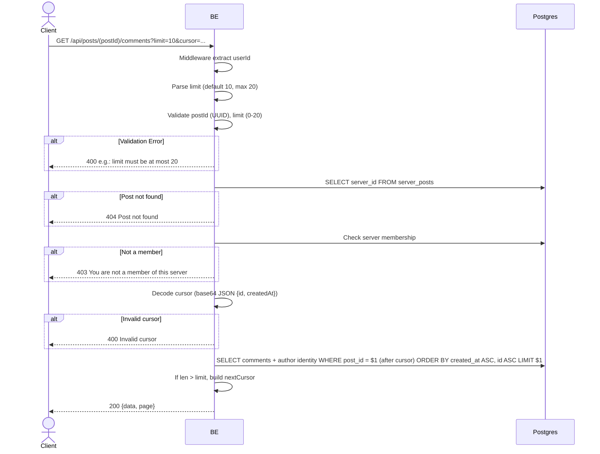

## Overview

This API is used to fetch the list of comments on a post. Sorted by `created_at` ASC (oldest first). Cursor-based pagination.

---

## Auth

This is a protected API, so it requires the authorization header `Bearer <accessToken>`.

## Flow



---

## Notes Redis

Does not use Redis.

---

## Notes Postgres/DB

| Table                    | Column                               | Action | Notes                                        |
| ------------------------ | ------------------------------------ | ------ | -------------------------------------------- |
| `server_posts`           | server_id                            | SELECT | Fetch server_id                               |
| `server_members`         | (count)                              | SELECT | Check membership                              |
| `server_post_comments`   | (all)                                | SELECT | Filter post_id, ORDER BY created_at ASC, id ASC |
| `server_member_profiles` | nickname, username, avatar_image_id  | SELECT | Author identity in the server                 |

---

## Prerequisites

User is a member of the server where the post resides.

---

## Request Validation

Path parameter:

| Field    | Type   | Required | Rules           |
| -------- | ------ | -------- | --------------- |
| `postId` | string | yes      | Required, UUID  |

Query parameters:

| Field    | Type   | Required | Rules                                               |
| -------- | ------ | -------- | --------------------------------------------------- |
| `limit`  | int    | no       | 0-20, default 10                                    |
| `cursor` | string | no       | Base64 JSON `{id, createdAt}` from the previous page |

---

## Response

### 200 OK

```json
{
  "data": [
    {
      "id": "comment-uuid",
      "postId": "post-uuid",
      "parentId": null,
      "content": "Mantap!",
      "author": {
        "userId": "user-uuid",
        "nickname": "GamerX",
        "username": "gamerx",
        "avatarUrl": "http://.../webp",
        "status": "active"
      },
      "isOwner": false,
      "createdAt": "2026-05-23T10:00:00Z",
      "updatedAt": "2026-05-23T10:00:00Z"
    }
  ],
  "page": {
    "nextCursor": "base64-encoded-cursor"
  }
}
```

### 400 Bad Request

| `error_message`               | Cause               |
| ----------------------------- | ------------------- |
| `postId is not a valid UUID`  | Invalid UUID         |
| `limit must be at most 20`    | Limit > 20           |
| `Invalid limit value`         | Limit is not an integer   |
| `Invalid cursor`              | Invalid cursor        |

### 403 Forbidden

| `error_message`                          | Cause        |
| ---------------------------------------- | ------------ |
| `You are not a member of this server`    | Not a member  |

### 404 Not Found

| `error_message`     | Cause           |
| ------------------- | --------------- |
| `Post not found`    | Post not found   |

### 401 Unauthorized

Standard auth errors.

---

## Update

This documentation was last updated on 20 July 2026.
