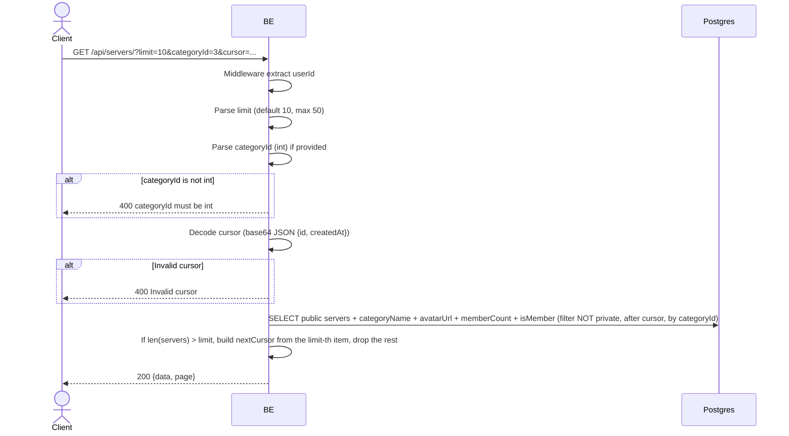

## Overview

This API is used for public server discovery — listing servers that a user can join. Cursor-based pagination (encoded base64 JSON). Can filter by category.

---

## Auth

This is a protected API, so it requires the authorization header `Bearer <accessToken>`.

## Flow



---

## Notes Redis

Does not use Redis (other than the auth-check middleware).

---

## Notes Postgres/DB

| Table                  | Column                                                               | Action | Notes                                            |
| ---------------------- | -------------------------------------------------------------------- | ------ | ------------------------------------------------ |
| `servers`              | id, name, short_name, category_id, description, avatar_image_id, created_at, settings | SELECT | Filter `settings->>'isPrivate' = 'false'`        |
| `server_categories`    | id, name                                                             | SELECT | Join to obtain categoryName                      |
| `server_avatar_images` | object_key                                                           | SELECT | Build avatar URL                                  |
| `server_members`       | (count + EXISTS)                                                     | SELECT | Member count + whether the user is a member      |

---

## Prerequisites

User is logged in with a valid access token.

---

## Request Validation

Query parameters:

| Field        | Type   | Required | Rules                                                  |
| ------------ | ------ | -------- | ------------------------------------------------------- |
| `limit`      | int    | no       | 1-50, default 10 (if out of range, reverts to 10)     |
| `categoryId` | int    | no       | Filter by category id (if not provided: all public) |
| `cursor`     | string | no       | Base64 JSON `{id, createdAt}` from the previous nextCursor |

---

## Response

### 200 OK

```json
{
  "data": [
    {
      "id": "uuid",
      "name": "Gaming Squad",
      "shortName": "GS",
      "categoryId": 3,
      "categoryName": "Gaming",
      "avatarUrl": "http://.../webp",
      "bannerUrl": null,
      "memberCount": 42,
      "isMember": false,
      "description": "Server gaming",
      "createdAt": "2026-05-23T10:00:00Z"
    }
  ],
  "page": {
    "nextCursor": "base64-encoded-cursor"
  }
}
```

`nextCursor` is empty if there is no next page.

### 400 Bad Request

| `error_message`           | Cause                                   |
| ------------------------- | --------------------------------------- |
| `categoryId must be int`  | categoryId is not an integer            |
| `Invalid cursor`          | Cursor cannot be decoded as base64/JSON  |

### 401 Unauthorized

| `error_message`                          | Cause              |
| ---------------------------------------- | ------------------ |
| `Authorization header is missing`        | Header is missing   |
| `Authentication token is invalid`        | Invalid JWT        |

---

## Update

This documentation was last updated on 23 May 2026.
