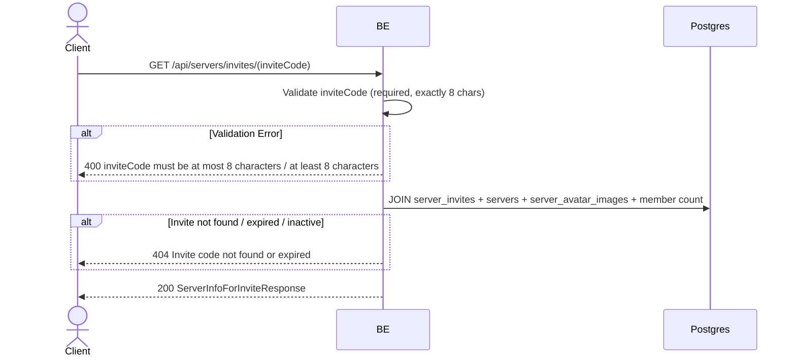

## Overview

This API is used to view the server info from an invite code BEFORE the user actually joins. Useful for previewing "You are about to join server X which has N members". This endpoint is public so it can be accessed from a shared invite link without logging in first.

---

## Auth

This is a public API, so no authorization header is required.

## Flow



---

## Notes Redis

This endpoint does not access Redis.

---

## Notes Postgres/DB

| Table                  | Column                           | Action | Notes                                             |
| ---------------------- | -------------------------------- | ------ | ------------------------------------------------- |
| `server_invites`       | code, server_id, expires_at, is_active | SELECT | Check invite is valid & fetch server_id         |
| `servers`              | id, name, avatar_image_id, owner_id | SELECT | Fetch server info for preview                  |
| `server_avatar_images` | object_key                       | SELECT | Build server avatar URL                          |
| `server_members`       | (count)                          | SELECT | Count member count                               |
| `server_member_profiles` | nickname                       | SELECT | Fetch the owner's nickname in that server        |

---

## Prerequisites

User has a valid invite code (8 alphanumeric characters).

---

## Request Validation

Path parameter:

| Field        | Type   | Required | Rules                                          |
| ------------ | ------ | -------- | ----------------------------------------------- |
| `inviteCode` | string | yes      | Required, exactly 8 characters (min 8, max 8)   |

---

## Response

### 200 OK

```json
{
  "code": "aB3xZ9pQ",
  "serverId": "550e8400-e29b-41d4-a716-446655440000",
  "serverName": "Gaming Squad",
  "serverAvatarUrl": "http://localhost:9000/virdan/server/avatar/...webp",
  "ownerNickname": "Owner_Nick",
  "memberCount": 42,
  "expiresAt": "2026-06-01T10:00:00Z"
}
```

| Field             | Type         | Description                                       |
| ----------------- | ------------ | ------------------------------------------------- |
| `code`            | string       | Invite code                                       |
| `serverId`        | string       | Server UUID                                       |
| `serverName`      | string       | Server name                                       |
| `serverAvatarUrl` | string/null  | Server avatar URL (null if none)          |
| `ownerNickname`   | string       | The owner's nickname in that server                |
| `memberCount`     | int          | Number of active members                           |
| `expiresAt`       | string/null  | ISO 8601 timestamp of invite expiry (null if no expiry) |

### 400 Bad Request

| `error_message`                              | Cause                          |
| -------------------------------------------- | ------------------------------ |
| `inviteCode is required`                     | inviteCode is empty            |
| `inviteCode must be at least 8 characters`   | Length less than 8              |
| `inviteCode must be at most 8 characters`    | Length more than 8             |

### 404 Not Found

| `error_message`                       | Cause                                          |
| ------------------------------------- | ---------------------------------------------- |
| `Invite code not found or expired`    | Invite not found / expired / is_active = false |

---

## Update

This documentation was last updated on 23 May 2026.
