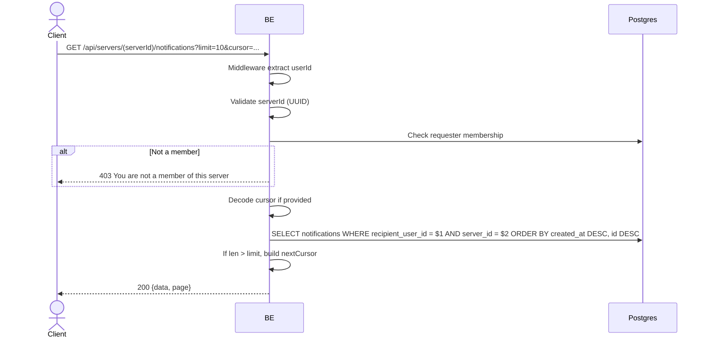

## Overview

Fetches the user's notification feed for a server (per-server, not global). Notifications archive interactions (like/comment/reply) on the user's content. Cursor-based pagination. The requester must be a member of the server.

---

## Auth

Protected API — requires header `Bearer <accessToken>`.

## Flow



---

## Notes Redis

Does not use Redis.

---

## Notes Postgres/DB

| Table                    | Column                         | Action | Notes                          |
| ------------------------ | ------------------------------ | ------ | ------------------------------ |
| `server_members`         | (count)                        | SELECT | Check requester membership     |
| `notifications`          | recipient_user_id, server_id   | SELECT | Filter user's notifs in server |
| `server_member_profiles` | username, avatar_image_id      | SELECT | Actor identity per server      |
| `profile_avatar_images`  | object_key                     | SELECT | Build actorAvatarUrl           |

---

## Prerequisites

The requester is a member of the server.

---

## Request Validation

| Field      | Type   | Required | Rules            |
| ---------- | ------ | -------- | ---------------- |
| `serverId` | string | yes      | Required, UUID   |
| `limit`    | int    | no       | 0-20, default 10 |
| `cursor`   | string | no       | Base64 `{createdAt, id}` |

---

## Response

### 200 OK

```json
{
  "data": [ /* NotificationResponse */ ],
  "page": { "nextCursor": "base64-or-empty" }
}
```

### 403 Forbidden

| `error_message`                       | Cause                  |
| ------------------------------------- | ---------------------- |
| `You are not a member of this server` | Requester not a member |

### 401 Unauthorized

Standard auth errors.

---

## Update

Created on 1 June 2026 (per-server notifications).
