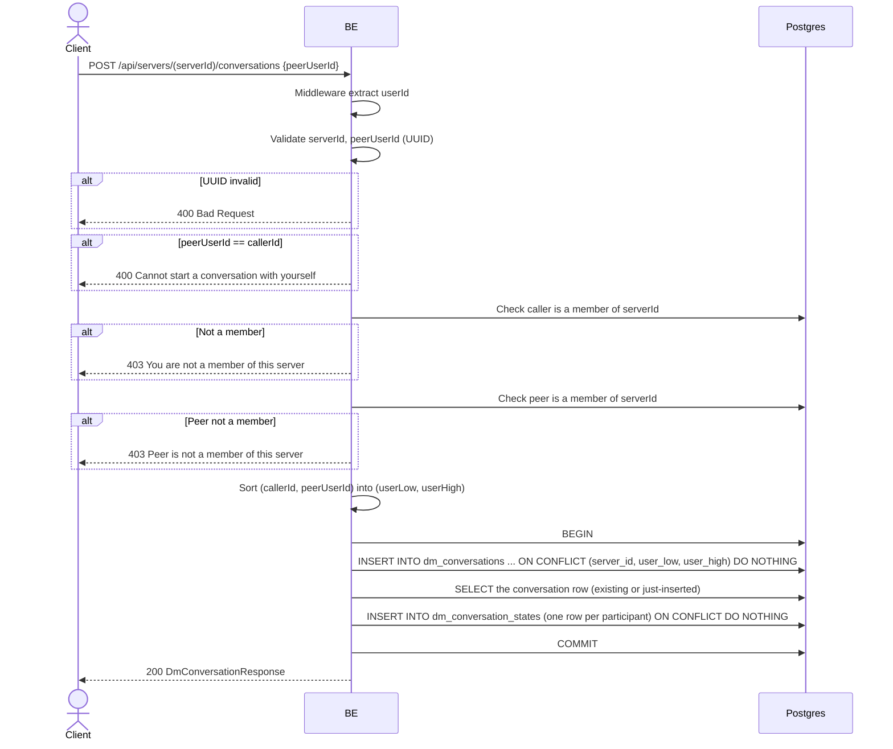

## Overview

This API returns the direct-message (DM) conversation between the caller and another member of the same server, creating it if it doesn't already exist yet. It is idempotent — calling it again for the same pair always returns the same conversation. Both users must be members of the given server; a conversation is scoped to exactly one server (the same two users on a different shared server get a separate conversation).

---

## Auth

This is a protected API, so it requires the authorization header `Bearer <accessToken>`.

## Flow



---

## Notes Redis

Does not use Redis directly (see `websocket_realtime.md` for how message/read/presence events fan out over the in-process WebSocket hub).

---

## Notes Postgres/DB

| Table                     | Column                                             | Action | Notes                                                                    |
| --------------------------- | ------------------------------------------------------ | ------ | -------------------------------------------------------------------------- |
| `server_members`          | (count)                                                  | SELECT | Membership check, run once for the caller and once for the peer            |
| `dm_conversations`        | id, server_id, user_low, user_high                     | INSERT | Idempotent via `ON CONFLICT (server_id, user_low, user_high) DO NOTHING`. `user_low`/`user_high` are the two participant ids sorted so the pair is always stored in one canonical order |
| `dm_conversations`        | (lookup)                                                | SELECT | Fetch the row (whether newly inserted or already existing)                   |
| `dm_conversation_states`  | conversation_id, user_id, server_id, peer_user_id       | INSERT | One row per participant (unread count, last-read cursor, preview), idempotent |

---

## Prerequisites

Both the caller and `peerUserId` must be members of `serverId`. The caller cannot target themselves.

---

## Request Validation

Path parameter:

| Field      | Type   | Required | Rules           |
| ---------- | ------ | -------- | --------------- |
| `serverId` | string | yes      | Required, UUID  |

JSON body:

| Field         | Type   | Required | Rules                                  |
| --------------- | ------ | -------- | ----------------------------------------- |
| `peerUserId`    | string | yes      | UUID, must not equal the caller's own id   |

---

## Response

### 200 OK

```json
{
  "id": "conversation-uuid",
  "serverId": "server-uuid",
  "peerUserId": "peer-user-uuid",
  "peer": {
    "nickname": "",
    "username": "",
    "avatarUrl": null
  },
  "unreadCount": 0,
  "isOnline": false,
  "lastMessagePreview": null,
  "lastMessageAt": null
}
```

| Field                  | Type        | Description                                                                |
| ------------------------ | ----------- | --------------------------------------------------------------------------- |
| `id`                    | string      | Conversation UUID (same value on every call for the same pair+server)        |
| `peer`                  | object      | **Not populated by this endpoint** — always returned as empty strings/`null`; use `list_conversations.md` or `list_dm_members.md` to get the peer's actual nickname/username/avatar |
| `unreadCount`, `isOnline`, `lastMessagePreview`, `lastMessageAt` | — | Always zero-value here; this endpoint does not read `dm_conversation_states`/presence, it only creates/looks up the conversation id |

### 400 Bad Request

| `error_message`                             | Cause                       |
| ---------------------------------------------- | -------------------------------- |
| `serverId is not a valid UUID`                 | Invalid `serverId`                |
| `peerUserId is not a valid UUID`               | Invalid `peerUserId`               |
| `Cannot start a conversation with yourself`    | `peerUserId` equals the caller     |

### 403 Forbidden

| `error_message`                            | Cause                          |
| ---------------------------------------------- | ----------------------------------- |
| `You are not a member of this server`         | Caller is not a member of `serverId` |
| `Peer is not a member of this server`         | `peerUserId` is not a member          |

### 401 Unauthorized

Standard auth errors.

---

## Update

This documentation was last updated on 20 July 2026.
