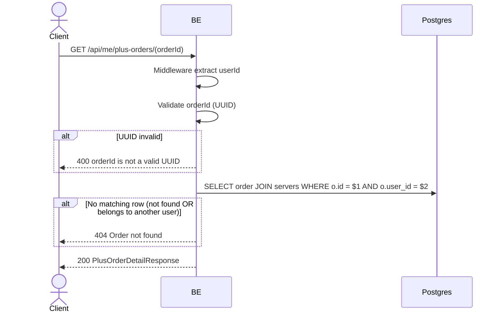

## Overview

This API fetches the full detail of a single Virdan Plus order belonging to the calling user. An order that exists but belongs to a different user is treated identically to a non-existent order (404), so this endpoint never leaks whether an `orderId` exists for someone else.

---

## Auth

This is a protected API, so it requires the authorization header `Bearer <accessToken>`.

## Flow



---

## Notes Redis

Does not use Redis.

---

## Notes Postgres/DB

| Table                | Column                                                                                  | Action | Notes                                                    |
| --------------------- | -------------------------------------------------------------------------------------------- | ------ | -------------------------------------------------------------- |
| `server_plus_orders`  | id, server_id, reference_id, base/tax/total_idr, status, paid_at, plus_expires_at, created_at | SELECT | Filtered by `id = orderId AND user_id = callerId`               |
| `servers`             | name                                                                                            | SELECT | Joined in for `serverName`                                       |

---

## Prerequisites

The order must belong to the calling user.

---

## Request Validation

Path parameter:

| Field     | Type   | Required | Rules           |
| --------- | ------ | -------- | --------------- |
| `orderId` | string | yes      | Required, UUID  |

No body.

---

## Response

### 200 OK

```json
{
  "id": "order-uuid",
  "serverId": "server-uuid",
  "serverName": "My Community",
  "referenceId": "virdan-plus-order-uuid",
  "baseIdr": 50000,
  "taxIdr": 5500,
  "totalIdr": 55500,
  "status": "PAID",
  "paidAt": "2026-06-01T10:00:00Z",
  "plusExpiresAt": "2026-07-01T10:00:00Z",
  "createdAt": "2026-06-01T09:59:00Z"
}
```

| Field           | Type        | Description                                  |
| --------------- | ----------- | ----------------------------------------------- |
| `referenceId`   | string      | The reference id sent to Xendit, `virdan-plus-{orderId}` |
| `status`        | string      | `PENDING`, `PAID`, or `FAILED`                    |
| `paidAt`        | string/null | Set once `status` is `PAID`                        |
| `plusExpiresAt` | string/null | Set once `status` is `PAID`                         |

### 400 Bad Request

| `error_message`               | Cause        |
| ------------------------------ | ------------ |
| `orderId is not a valid UUID`  | Invalid UUID |

### 404 Not Found

| `error_message`    | Cause                                                  |
| -------------------- | ----------------------------------------------------------- |
| `Order not found`    | Order does not exist, or exists but belongs to another user |

### 401 Unauthorized

Standard auth errors.

---

## Update

This documentation was last updated on 20 July 2026.
