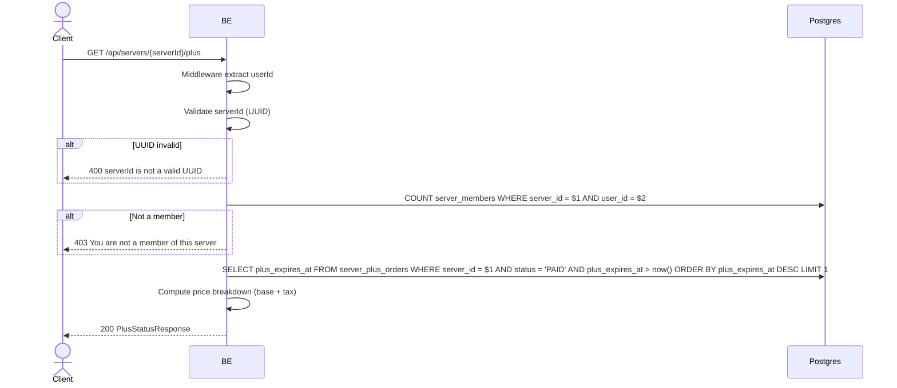

## Overview

This API is used to fetch the Virdan Plus subscription status of a server: whether it is currently active, when it expires, and the current price breakdown for purchasing/renewing it.

---

## Auth

This is a protected API, so it requires the authorization header `Bearer <accessToken>`.

## Flow



---

## Notes Redis

Does not use Redis.

---

## Notes Postgres/DB

| Table                 | Column          | Action | Notes                                                              |
| --------------------- | --------------- | ------ | ------------------------------------------------------------------- |
| `server_members`      | (count)         | SELECT | Check whether the caller is a member of the server                  |
| `server_plus_orders`  | plus_expires_at | SELECT | Latest still-valid `PAID` order (`status = 'PAID' AND plus_expires_at > now()`), most recent expiry wins |

---

## Prerequisites

Caller must be a member of the target server.

---

## Request Validation

Path parameter:

| Field      | Type   | Required | Rules           |
| ---------- | ------ | -------- | --------------- |
| `serverId` | string | yes      | Required, UUID  |

No body.

---

## Response

### 200 OK

```json
{
  "active": false,
  "expiresAt": null,
  "durationDays": 30,
  "price": {
    "baseIdr": 50000,
    "taxIdr": 5500,
    "totalIdr": 55500
  }
}
```

| Field                 | Type        | Description                                                         |
| --------------------- | ----------- | --------------------------------------------------------------------- |
| `active`              | bool        | `true` if there is an unexpired `PAID` order for this server          |
| `expiresAt`           | string/null | Expiry timestamp of the active order, `null` if `active` is `false`   |
| `durationDays`        | int         | Fixed subscription length in days (currently `30`)                    |
| `price.baseIdr`       | int         | Base price in IDR (currently `50000`)                                 |
| `price.taxIdr`        | int         | Tax, 11% of base, in IDR (currently `5500`)                            |
| `price.totalIdr`      | int         | `baseIdr + taxIdr` (currently `55500`)                                 |

### 400 Bad Request

| `error_message`                | Cause        |
| ------------------------------- | ------------ |
| `serverId is not a valid UUID`  | Invalid UUID |

### 403 Forbidden

| `error_message`                        | Cause        |
| ---------------------------------------- | ------------ |
| `You are not a member of this server`    | Not a member |

### 401 Unauthorized

Standard auth errors.

---

## Update

This documentation was last updated on 20 July 2026.
