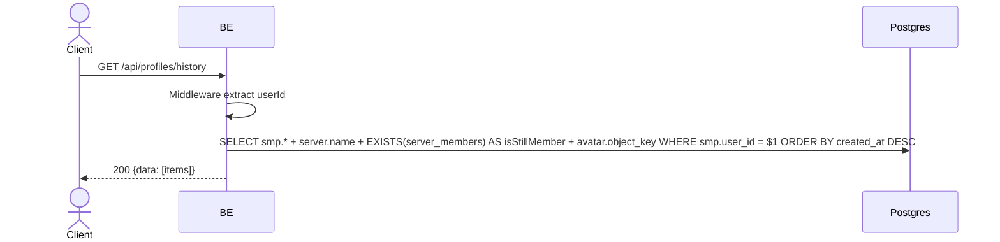

## Overview

This API is used to fetch all per-server profiles owned by the user (historical snapshot). Useful for the "pick a profile from another server" picker — the user can reuse a profile that was previously created in another server (multi-identity Option B). Includes servers the user has already left (`server_member_profiles` retained after leave).

---

## Auth

This is a protected API, so it requires the authorization header `Bearer <accessToken>`.

## Flow



---

## Notes Redis

Does not use Redis.

---

## Notes Postgres/DB

| Table                     | Column                                                               | Action | Notes                                     |
| ------------------------- | -------------------------------------------------------------------- | ------ | ----------------------------------------- |
| `server_member_profiles`  | id, server_id, nickname, username, bio, avatar_image_id, created_at, updated_at | SELECT | Filter user_id, ORDER BY created_at DESC |
| `servers`                 | name                                                                 | SELECT | JOIN for serverName                       |
| `server_members`          | (EXISTS)                                                             | SELECT | Check `isStillMember`                     |
| `profile_avatar_images`   | object_key                                                           | SELECT | Build avatarUrl                            |

---

## Prerequisites

User is already logged in. Has joined at least one server.

---

## Request Validation

No body, no path/query parameter.

---

## Response

### 200 OK

```json
{
  "data": [
    {
      "profileId": "profile-uuid",
      "serverId": "server-uuid",
      "serverName": "Gaming Squad",
      "nickname": "GamerX",
      "username": "gamerx",
      "bio": "Always grinding",
      "avatarImageId": "avatar-uuid",
      "avatarUrl": "http://.../profile/avatar/uuid.webp",
      "isStillMember": true,
      "createdAt": "2026-05-20T10:00:00Z",
      "updatedAt": "2026-05-22T08:00:00Z"
    }
  ]
}
```

| Field           | Type        | Description                                        |
| --------------- | ----------- | -------------------------------------------------- |
| `profileId`     | string      | UUID `server_member_profiles`                       |
| `serverId`      | string      | Server UUID                                         |
| `serverName`    | string      | Server name                                         |
| `nickname`      | string      | Nickname in that server                             |
| `username`      | string      | Username in that server (unique per server)          |
| `bio`           | string/null | Bio in that server                                   |
| `avatarImageId` | string/null | Avatar UUID                                          |
| `avatarUrl`     | string/null | Avatar URL (null if none)                           |
| `isStillMember` | bool        | `true` if the user is still a member, `false` if already left |
| `createdAt`     | string      | ISO 8601                                             |
| `updatedAt`     | string      | ISO 8601                                             |

### 401 Unauthorized

| `error_message`                       | Cause          |
| ------------------------------------- | -------------- |
| `Authorization header is missing`     | Header is missing |
| `Authentication token is invalid`    | JWT invalid    |

---

## Update

This documentation was last updated on 23 May 2026.
