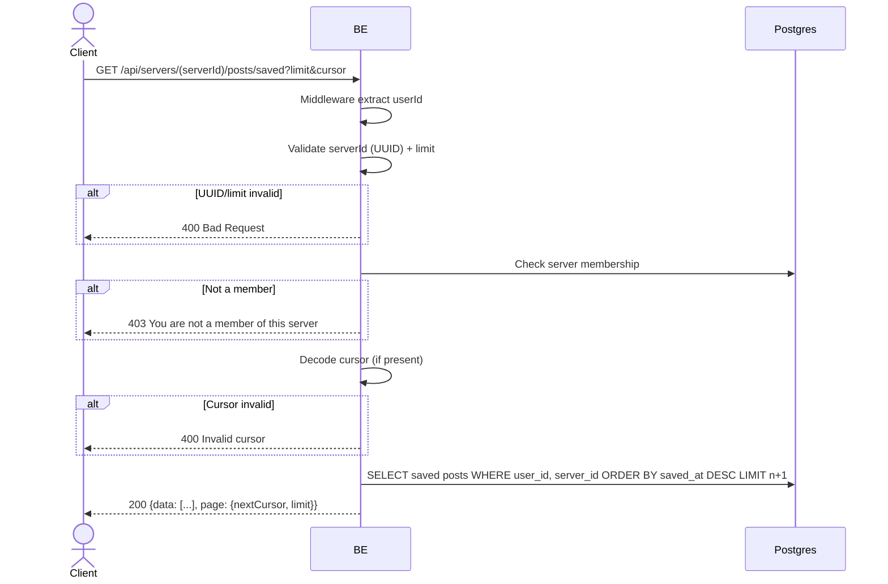

## Overview

This API retrieves the list of posts a user has saved within a server (per-server, not cross-server). Results are ordered by most recently saved (`server_post_saves.created_at DESC`). Cursor-based pagination. Posts whose author has left/been deleted still appear with `author.status` (`user_left`/`user_deleted`).

---

## Auth

This is a protected API, so it requires the authorization header `Bearer <accessToken>`.

## Flow



---

## Notes Redis

Does not use Redis.

---

## Notes Postgres/DB

| Table                     | Column                | Action | Notes                                               |
| ------------------------- | --------------------- | ------ | --------------------------------------------------- |
| `server_members`          | (count)               | SELECT | Check requester membership                          |
| `server_post_saves`       | user_id, created_at   | SELECT | Saved feed source, ordered by save time desc, cursor filter |
| `server_posts`            | (join)                | SELECT | Post data + filter `server_id`                      |
| `users`                   | deleted_at            | SELECT | Author status (user_deleted)                        |
| `server_members`          | (left join author)    | SELECT | Author status (user_left)                           |
| `server_member_profiles`  | nickname, username    | SELECT | Per-server author identity                          |
| `server_post_likes`       | (count + exists)      | SELECT | likeCount + userLiked                               |
| `server_post_comments`    | (count)               | SELECT | commentCount                                        |

---

## Prerequisites

User is a member of the requested server.

---

## Request Validation

Path parameter:

| Field      | Type   | Required | Rules           |
| ---------- | ------ | -------- | --------------- |
| `serverId` | string | yes      | Required, UUID  |

Query parameter:

| Field    | Type   | Required | Rules                        |
| -------- | ------ | -------- | ---------------------------- |
| `limit`  | int    | no       | 0..MAX_LIMIT (default)       |
| `cursor` | string | no       | Cursor from previous response |

---

## Response

### 200 OK

```json
{
  "data": [
    {
      "id": "post-uuid",
      "serverId": "server-uuid",
      "caption": "Hello",
      "imageUrl": "http://.../post/image/uuid.webp",
      "author": {
        "userId": "user-uuid",
        "nickname": "GamerX",
        "username": "gamerx",
        "avatarUrl": null,
        "status": "active"
      },
      "likeCount": 3,
      "commentCount": 1,
      "userLiked": false,
      "userSaved": true,
      "savedAt": "2026-06-02T07:00:00Z",
      "isOwner": false,
      "createdAt": "2026-05-20T10:00:00Z",
      "updatedAt": "2026-05-20T10:00:00Z"
    }
  ],
  "page": {
    "nextCursor": "base64-cursor-or-null",
    "limit": 10
  }
}
```

| Field           | Type        | Description                                          |
| --------------- | ----------- | --------------------------------------------------- |
| `userSaved`     | bool        | Always `true` in the saved feed                     |
| `savedAt`       | string/null | When the post was saved (`server_post_saves.created_at`), the ordering + cursor basis |
| `author.status` | string      | `active`, `user_left`, or `user_deleted`            |

### 400 Bad Request

| `error_message`                 | Cause            |
| ------------------------------- | ---------------- |
| `serverId is not a valid UUID`  | Invalid UUID     |
| `Invalid cursor`                | Corrupted cursor |

### 403 Forbidden

| `error_message`                          | Cause        |
| ---------------------------------------- | ------------ |
| `You are not a member of this server`    | Not a member |

### 401 Unauthorized

Standard auth errors.

---

## Update

This documentation was last updated on 2 June 2026.
