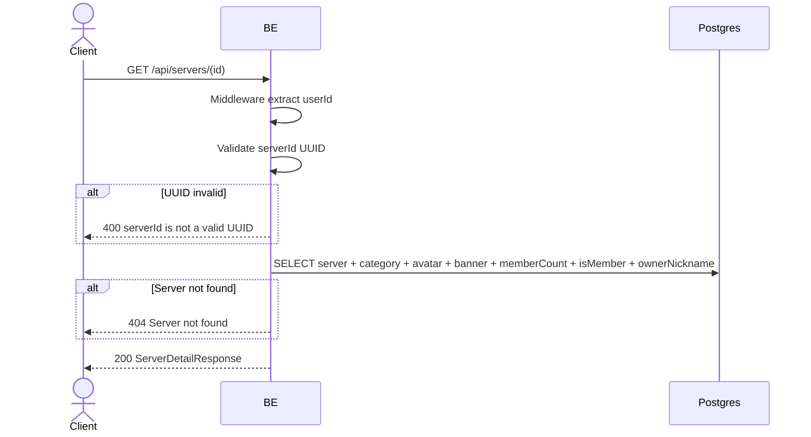

## Overview

This API is used to fetch server details by ID. Returnable for any user (no membership filter) — the frontend can check `isMember` in the response.

---

## Auth

This is a protected API, so it requires the authorization header `Bearer <accessToken>`.

## Flow



---

## Notes Redis

Does not use Redis (other than the auth-check middleware).

---

## Notes Postgres/DB

| Table                     | Column                                   | Action | Notes                                       |
| ------------------------- | ---------------------------------------- | ------ | ------------------------------------------- |
| `servers`                 | (all)                                    | SELECT | Server details                               |
| `server_categories`       | id, name                                 | SELECT | JOIN for categoryName                       |
| `server_avatar_images`    | object_key                               | SELECT | Build avatarUrl                              |
| `server_banner_images`    | object_key                               | SELECT | Build bannerUrl                              |
| `server_members`          | (count + EXISTS)                         | SELECT | memberCount + isMember                       |
| `server_member_profiles`  | nickname                                 | SELECT | Owner nickname                                |

---

## Prerequisites

User is already logged in with a valid access token.

---

## Request Validation

Path parameter:

| Field | Type   | Required | Rules                      |
| ----- | ------ | -------- | -------------------------- |
| `id`  | string | yes      | Required, must be a valid UUID |

---

## Response

### 200 OK

```json
{
  "id": "uuid",
  "ownerId": "user-uuid",
  "ownerNickname": "OwnerNick",
  "name": "Gaming Squad",
  "shortName": "GS",
  "categoryId": 3,
  "categoryName": "Gaming",
  "avatarUrl": "http://.../webp",
  "bannerUrl": null,
  "description": "Server gaming",
  "settings": {"isPrivate": false},
  "memberCount": 42,
  "isMember": true,
  "createdAt": "2026-05-23T10:00:00Z",
  "updatedAt": "2026-05-23T10:00:00Z"
}
```

### 400 Bad Request

| `error_message`                 | Cause                     |
| ------------------------------- | ------------------------- |
| `serverId is required`          | serverId empty             |
| `serverId is not a valid UUID`  | Format is not a UUID      |

### 404 Not Found

| `error_message`        | Cause                 |
| ---------------------- | --------------------- |
| `Server not found`     | Server not found       |

### 401 Unauthorized

Standard auth errors.

---

## Update

This documentation was last updated on 23 May 2026.
