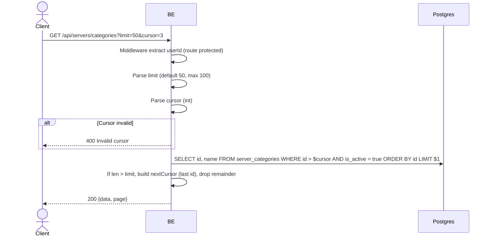

## Overview

This API is used to fetch the list of server categories. Cursor-based pagination (cursor = last integer id).

---

## Auth

This is a protected API, so it requires the authorization header `Bearer <accessToken>`.

## Flow



---

## Notes Redis

Does not use Redis (other than the auth-check middleware).

---

## Notes Postgres/DB

| Table               | Column       | Action | Notes                               |
| ------------------- | ------------ | ------ | ----------------------------------- |
| `server_categories` | id, name, is_active | SELECT | Filter active, ORDER BY id ASC |

---

## Prerequisites

User is already logged in with a valid access token.

---

## Request Validation

Query parameters:

| Field    | Type   | Required | Rules                                           |
| -------- | ------ | -------- | ----------------------------------------------- |
| `limit`  | int    | no       | 1-100, default 50 (out of range → 50)           |
| `cursor` | int    | no       | Last id from the previous page                  |

---

## Response

### 200 OK

```json
{
  "data": [
    { "id": 1, "categoryName": "Education" },
    { "id": 2, "categoryName": "Music" },
    { "id": 3, "categoryName": "Gaming" }
  ],
  "page": {
    "nextCursor": "3"
  }
}
```

| Field          | Type   | Description                                        |
| -------------- | ------ | -------------------------------------------------- |
| `id`           | int    | Category ID                                        |
| `categoryName` | string | Category name                                      |
| `nextCursor`   | string | Last id for the next page (empty = exhausted)      |

### 400 Bad Request

| `error_message`     | Cause                                          |
| ------------------- | ---------------------------------------------- |
| `Invalid cursor`    | Cursor is not a valid integer                  |

### 401 Unauthorized

Standard auth errors.

---

## Update

This documentation was last updated on 23 May 2026.
