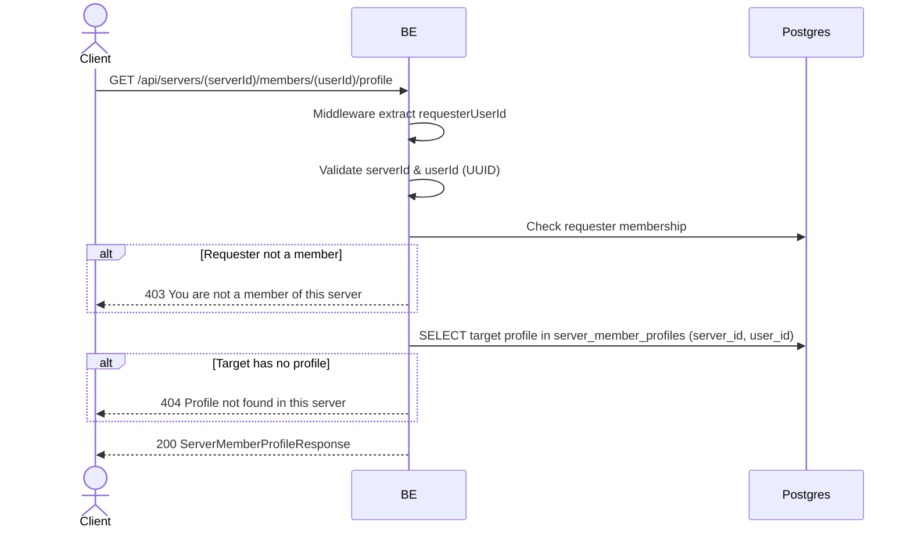

## Overview

This API is used to view another member's profile in a server (view-only). Profiles are per-server (multi-identity Option B), so the response is the target's identity specific to that server. The requester must be a member of the server to prevent enumerating a private server's roster.

---

## Auth

This is a protected API, so it requires the authorization header `Bearer <accessToken>`.

## Flow



---

## Notes Redis

Does not use Redis.

---

## Notes Postgres/DB

| Table                    | Column                                   | Action | Notes                       |
| ------------------------ | ---------------------------------------- | ------ | --------------------------- |
| `server_members`         | (count)                                  | SELECT | Check requester membership  |
| `server_member_profiles` | nickname, username, bio, avatar_image_id | SELECT | Target profile per server   |
| `profile_avatar_images`  | object_key                               | SELECT | Build avatarUrl             |

---

## Prerequisites

The requester is a member of the server. The target user has (or had) a profile in the server (the copy-on-join snapshot persists even after the target leaves).

---

## Request Validation

Path parameter:

| Field      | Type   | Required | Rules          |
| ---------- | ------ | -------- | -------------- |
| `serverId` | string | yes      | Required, UUID |
| `userId`   | string | yes      | Required, UUID |

---

## Response

### 200 OK

```json
{
  "profileId": "uuid",
  "serverId": "uuid",
  "nickname": "BudiPro",
  "username": "budipro",
  "bio": "Always grinding",
  "avatarImageId": "uuid-or-null",
  "avatarUrl": "https://...-or-null",
  "createdAt": "2026-06-01T10:30:00Z",
  "updatedAt": "2026-06-01T10:30:00Z"
}
```

### 400 Bad Request

| `error_message`                | Cause        |
| ------------------------------ | ------------ |
| `serverId is not a valid UUID` | UUID invalid |
| `userId is not a valid UUID`   | UUID invalid |

### 403 Forbidden

| `error_message`                       | Cause             |
| ------------------------------------- | ----------------- |
| `You are not a member of this server` | Requester not a member |

### 404 Not Found

| `error_message`                      | Cause                              |
| ------------------------------------ | ---------------------------------- |
| `Profile not found in this server`   | Target has no profile in the server |

### 401 Unauthorized

Standard auth errors.

---

## Update

This documentation was created on 1 June 2026.
