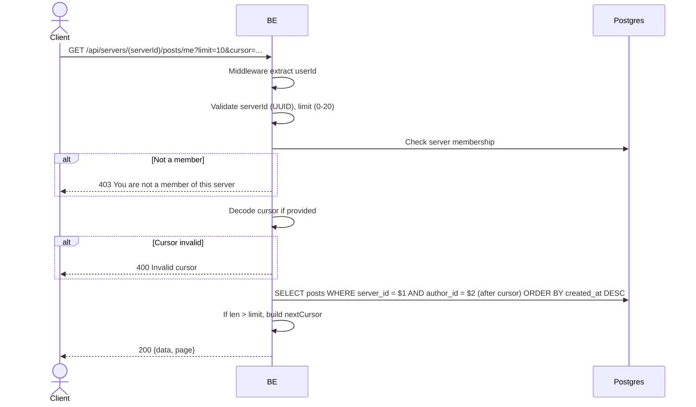

## Overview

This API is used to fetch the list of the user's own posts in a server. Same as `get_server_posts` but filtered by `author_id = userId`. Cursor-based pagination.

---

## Auth

This is a protected API, so it requires the authorization header `Bearer <accessToken>`.

## Flow



---

## Notes Redis

Does not use Redis.

---

## Notes Postgres/DB

| Table                    | Column             | Action | Notes                                       |
| ------------------------ | ------------------ | ------ | ------------------------------------------- |
| `server_members`         | (count)            | SELECT | Check membership                             |
| `server_posts`           | server_id, author_id | SELECT | Filter posts owned by the user in that server |
| `server_post_images`     | object_key         | SELECT | Build imageUrl                                |
| `server_post_likes`      | (count + EXISTS)   | SELECT | likeCount + userLiked                         |
| `server_post_comments`   | (count)            | SELECT | commentCount                                  |
| `server_member_profiles` | nickname, username, avatar_image_id | SELECT | Author identity per server      |

---

## Prerequisites

User is a member of the server.

---

## Request Validation

Path parameter:

| Field      | Type   | Required | Rules           |
| ---------- | ------ | -------- | --------------- |
| `serverId` | string | yes      | Required, UUID  |

Query parameters:

| Field    | Type   | Required | Rules                                               |
| -------- | ------ | -------- | --------------------------------------------------- |
| `limit`  | int    | no       | 0-20, default 10                                    |
| `cursor` | string | no       | Base64 JSON `{id, createdAt}` from the previous page |

---

## Response

### 200 OK

Same format as `get_server_posts`, only containing posts owned by the currently logged-in user.

```json
{
  "data": [ /* ServerPostResponse */ ],
  "page": {
    "nextCursor": "base64-encoded"
  }
}
```

### 400 Bad Request

| `error_message`                  | Cause               |
| -------------------------------- | ------------------- |
| `serverId is not a valid UUID`   | UUID invalid         |
| `limit must be at most 20`       | Limit > 20           |
| `Invalid cursor`                 | Cursor invalid        |

### 403 Forbidden

| `error_message`                          | Cause        |
| ---------------------------------------- | ------------ |
| `You are not a member of this server`    | Not a member  |

### 401 Unauthorized

Standard auth errors.

---

## Update

This documentation was last updated on 23 May 2026.
