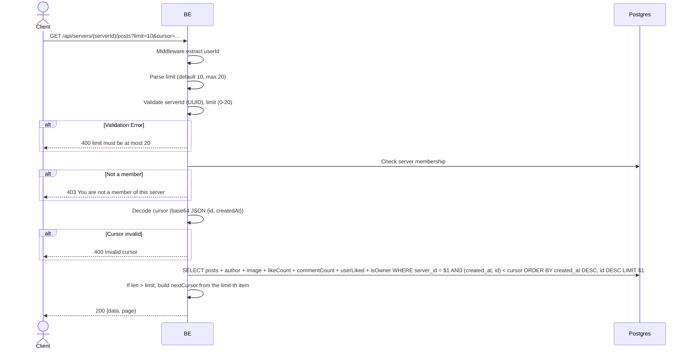

## Overview

This API is used to fetch the list of posts in a server (feed). Sorted by `created_at` descending (newest first). Cursor-based pagination. The user must be a member of that server.

---

## Auth

This is a protected API, so it requires the authorization header `Bearer <accessToken>`.

## Flow



---

## Notes Redis

Does not use Redis.

---

## Notes Postgres/DB

| Table                    | Column                  | Action | Notes                                            |
| ------------------------ | ----------------------- | ------ | ------------------------------------------------ |
| `server_members`         | (count)                 | SELECT | Check membership                                  |
| `server_posts`           | (all)                   | SELECT | Filter server_id, ORDER BY created_at DESC, id DESC |
| `server_post_images`     | object_key              | SELECT | Build imageUrl                                    |
| `server_post_likes`      | (count + EXISTS)        | SELECT | likeCount + userLiked                             |
| `server_post_comments`   | (count)                 | SELECT | commentCount                                      |
| `server_member_profiles` | nickname, username, avatar_image_id | SELECT | Author identity per server                  |

---

## Prerequisites

User is a member of the server.

---

## Request Validation

Path parameter:

| Field      | Type   | Required | Rules           |
| ---------- | ------ | -------- | --------------- |
| `serverId` | string | yes      | Required, UUID  |

Query parameters:

| Field    | Type   | Required | Rules                                               |
| -------- | ------ | -------- | --------------------------------------------------- |
| `limit`  | int    | no       | 0-20, default 10                                    |
| `cursor` | string | no       | Base64 JSON `{id, createdAt}` from the previous page |

---

## Response

### 200 OK

```json
{
  "data": [
    {
      "id": "post-uuid",
      "serverId": "server-uuid",
      "caption": "Hello!",
      "imageUrl": "http://.../webp",
      "author": {
        "userId": "user-uuid",
        "nickname": "GamerX",
        "username": "gamerx",
        "avatarUrl": "http://.../webp",
        "status": "ACTIVE"
      },
      "likeCount": 12,
      "commentCount": 3,
      "userLiked": false,
      "isOwner": false,
      "createdAt": "2026-05-23T10:00:00Z",
      "updatedAt": "2026-05-23T10:00:00Z"
    }
  ],
  "page": {
    "nextCursor": "base64-encoded-cursor"
  }
}
```

### 400 Bad Request

| `error_message`                  | Cause                   |
| -------------------------------- | ----------------------- |
| `serverId is not a valid UUID`   | UUID invalid             |
| `limit must be at most 20`       | Limit more than 20       |
| `limit must be at least 0`       | Limit negative           |
| `Invalid cursor`                 | Cursor cannot be decoded  |

### 403 Forbidden

| `error_message`                          | Cause        |
| ---------------------------------------- | ------------ |
| `You are not a member of this server`    | Not a member  |

### 401 Unauthorized

Standard auth errors.

---

## Update

This documentation was last updated on 23 May 2026.
