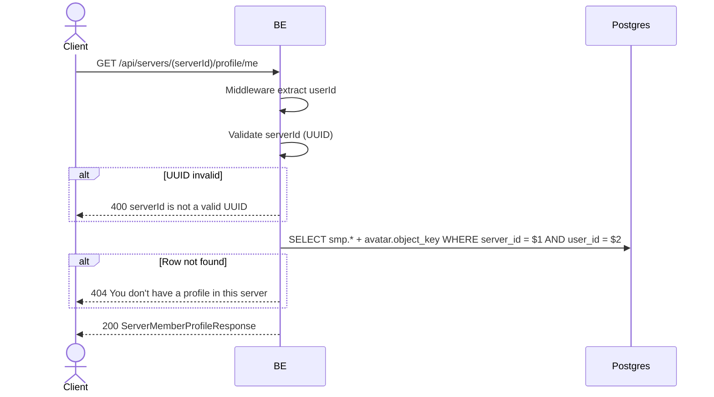

## Overview

This API is used to fetch the per-server profile of the currently logged-in user in a specific server. Useful for the frontend to display "your identity in this server".

---

## Auth

This is a protected API, so it requires the authorization header `Bearer <accessToken>`.

## Flow



---

## Notes Redis

Does not use Redis.

---

## Notes Postgres/DB

| Table                     | Column                                                 | Action | Notes                                   |
| ------------------------- | ------------------------------------------------------ | ------ | --------------------------------------- |
| `server_member_profiles`  | id, server_id, nickname, username, bio, avatar_image_id, created_at, updated_at | SELECT | Filter (server_id, user_id) |
| `profile_avatar_images`   | object_key                                             | SELECT | Build avatarUrl                          |

---

## Prerequisites

User is already logged in. User has joined the server (the `server_member_profiles` row exists — even after leaving the row still exists).

---

## Request Validation

Path parameter:

| Field      | Type   | Required | Rules           |
| ---------- | ------ | -------- | --------------- |
| `serverId` | string | yes      | Required, UUID  |

No body.

---

## Response

### 200 OK

```json
{
  "profileId": "profile-uuid",
  "serverId": "server-uuid",
  "nickname": "GamerX",
  "username": "gamerx",
  "bio": "Always grinding",
  "avatarImageId": "avatar-uuid",
  "avatarUrl": "http://.../profile/avatar/uuid.webp",
  "createdAt": "2026-05-20T10:00:00Z",
  "updatedAt": "2026-05-22T08:00:00Z"
}
```

### 400 Bad Request

| `error_message`                  | Cause           |
| -------------------------------- | --------------- |
| `serverId is not a valid UUID`   | UUID invalid    |

### 404 Not Found

| `error_message`                              | Cause                                   |
| -------------------------------------------- | --------------------------------------- |
| `You don't have a profile in this server`    | Row in `server_member_profiles` not found |

### 401 Unauthorized

Standard auth errors.

---

## Update

This documentation was last updated on 23 May 2026.
