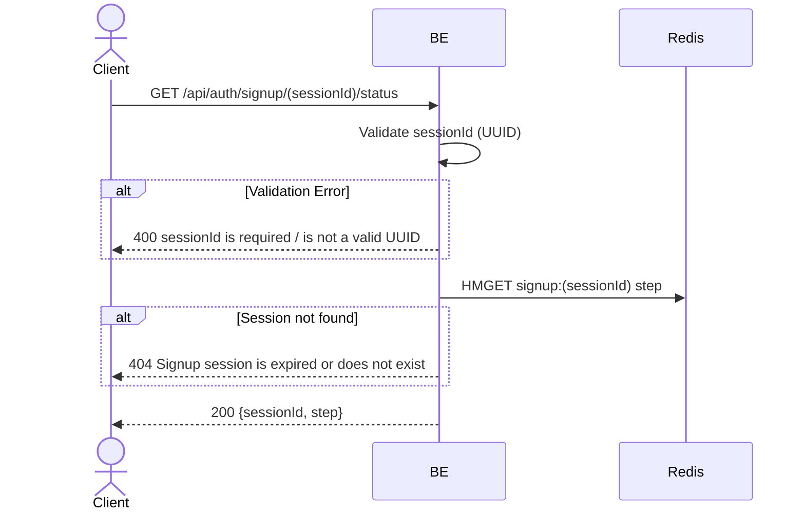

## Overview

This API is used to check the progress of a signup session. Useful for the frontend to know which step the user is on (for example after a page refresh).

---

## Auth

This is a public API, so no authorization header is required.

## Flow



---

## Notes Redis

1. signup session:
   key: `signup:(sessionId)`
   action: HMGET field `step`

---

## Notes Postgres/DB

This endpoint does not access Postgres.

---

## Prerequisites

User has a `sessionId` from the previous `start_signup` step.

---

## Request Validation

Path parameter:

| Field       | Type   | Required | Rules                      |
| ----------- | ------ | -------- | -------------------------- |
| `sessionId` | string | yes      | Required, must be a valid UUID |

---

## Response

### 200 OK

```json
{
  "sessionId": "550e8400-e29b-41d4-a716-446655440000",
  "step": "otp_verified"
}
```

| Field       | Type   | Description                                                               |
| ----------- | ------ | ------------------------------------------------------------------------- |
| `sessionId` | string | Signup session UUID                                                       |
| `step`      | string | One of: `start_signup`, `otp_verified`, `password_set`                    |

### 400 Bad Request

| `error_message`                 | Cause                       |
| ------------------------------- | --------------------------- |
| `sessionId is required`         | Session id empty             |
| `sessionId is not a valid UUID` | Format is not a UUID            |

### 404 Not Found

| `error_message`                                | Cause                                 |
| ---------------------------------------------- | ------------------------------------- |
| `Signup session is expired or does not exist`  | Session no longer exists in Redis       |

---

## Update

This documentation was last updated on 23 May 2026.
