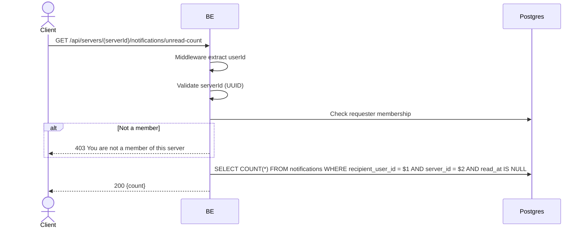

## Overview

Fetches the unread notification count for the badge, per-server. The requester must be a member of the server.

---

## Auth

Protected API — requires header `Bearer <accessToken>`.

## Flow



---

## Notes Redis

Does not use Redis.

---

## Notes Postgres/DB

| Table            | Column                       | Action | Notes                          |
| ---------------- | ---------------------------- | ------ | ------------------------------ |
| `server_members` | (count)                      | SELECT | Check requester membership     |
| `notifications`  | recipient_user_id, server_id | SELECT | COUNT unread (read_at IS NULL) |

---

## Prerequisites

The requester is a member of the server.

---

## Request Validation

| Field      | Type   | Required | Rules          |
| ---------- | ------ | -------- | -------------- |
| `serverId` | string | yes      | Required, UUID |

---

## Response

### 200 OK

```json
{ "count": 3 }
```

### 400 Bad Request

| `error_message`                 | Cause                            |
| -------------------------------- | --------------------------------- |
| `serverId is required`          | serverId path segment empty      |
| `serverId is not a valid UUID`  | serverId is not in UUID format   |

### 403 Forbidden

| `error_message`                       | Cause                  |
| ------------------------------------- | ---------------------- |
| `You are not a member of this server` | Requester not a member |

### 401 Unauthorized

Standard auth errors.

---

## Update

Created on 1 June 2026 (per-server notifications).
Updated on 20 July 2026 (added the 400 Bad Request validation error table).
