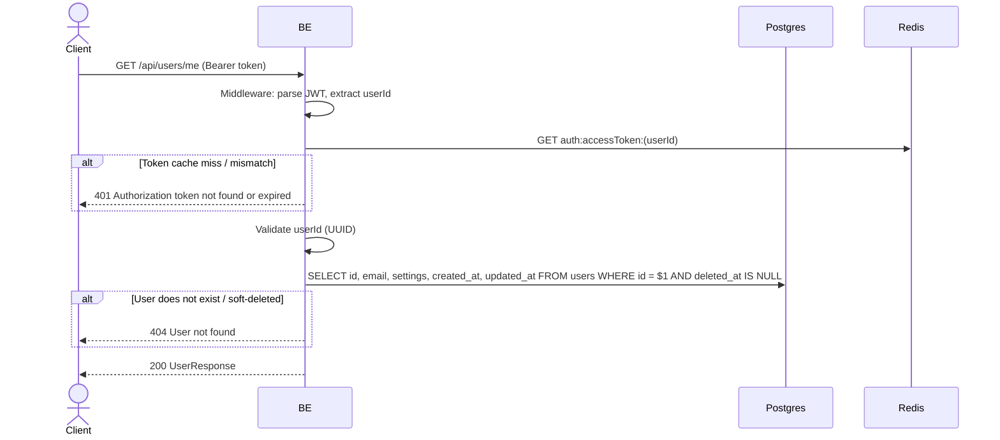

## Overview

This API is used to get account info for the currently logged-in user. It fetches the global user data (id, email, settings, timestamps). Per-server fields (nickname/bio/avatar) live in the profile endpoint, not here (multi-identity Option B).

---

## Auth

This is a protected API, so it requires the authorization header `Bearer <accessToken>`.

## Flow



---

## Notes Redis

1. auth access token (checked by middleware):
   key: `auth:accessToken:(userId)`
   action: GET

---

## Notes Postgres/DB

| Table   | Column                                      | Action | Notes                                   |
| ------- | ------------------------------------------- | ------ | --------------------------------------- |
| `users` | id, email, settings, created_at, updated_at | SELECT | Fetch global user data, filter soft-delete |

---

## Prerequisites

User is already logged in and has a valid access token (not yet expired).

---

## Request Validation

This endpoint does not accept a body. Authentication is done via the `Authorization: Bearer <accessToken>` header.

---

## Response

### 200 OK

```json
{
  "id": "550e8400-e29b-41d4-a716-446655440000",
  "email": "user@example.com",
  "settings": {},
  "createdAt": "2026-05-23T10:00:00Z",
  "updatedAt": "2026-05-23T10:00:00Z"
}
```

| Field       | Type   | Description                            |
| ----------- | ------ | -------------------------------------- |
| `id`        | string | User UUID                              |
| `email`     | string | User email                             |
| `settings`  | object | JSONB settings (default `{}`)          |
| `createdAt` | string | ISO 8601 timestamp UTC                 |
| `updatedAt` | string | ISO 8601 timestamp UTC                 |

### 401 Unauthorized

| `error_message`                              | Cause                                          |
| -------------------------------------------- | ---------------------------------------------- |
| `Authorization header is missing`            | The `Authorization` header is missing          |
| `Invalid authorization scheme`               | Not using the `Bearer ` prefix                 |
| `Authentication token is empty`              | Token is empty after stripping the prefix      |
| `Authentication token is malformed`          | Malformed JWT format                           |
| `Authentication token is expired`            | JWT expired                                    |
| `Authentication token is invalid`            | JWT signature invalid / claim invalid          |
| `Authorization token not found or expired`   | Token is not in the Redis cache                |
| `Authorization token is expired`             | Token hash differs from the one in the cache   |

### 404 Not Found

| `error_message`    | Cause                                   |
| ------------------ | --------------------------------------- |
| `User not found`   | User does not exist or has been soft-deleted |

---

## Update

This documentation was last updated on 23 May 2026.
