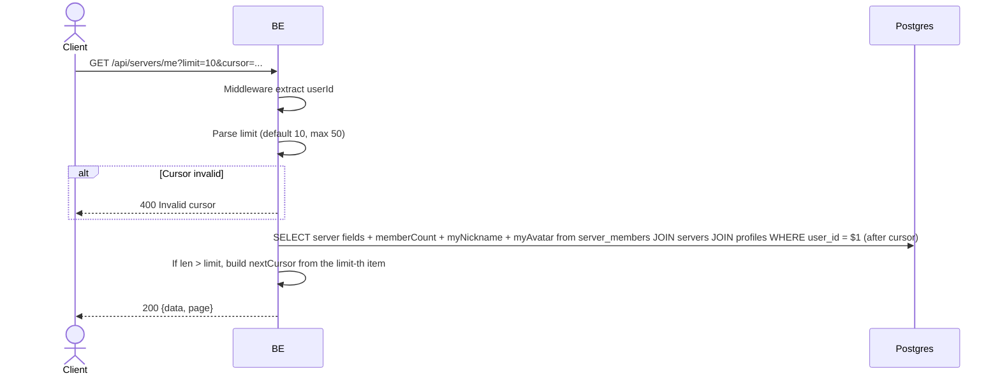

## Overview

This API is used to fetch the list of servers the user has joined. Sorted by `joined_at` descending with cursor-based pagination.

---

## Auth

This is a protected API, so it requires the authorization header `Bearer <accessToken>`.

## Flow



---

## Notes Redis

Does not use Redis (other than the auth-check middleware).

---

## Notes Postgres/DB

| Table                     | Column                                   | Action | Notes                                             |
| ------------------------- | ---------------------------------------- | ------ | ------------------------------------------------- |
| `server_members`          | server_id, user_id, joined_at            | SELECT | Filter by user, sort joined_at DESC, after cursor |
| `servers`                 | id, name, short_name, category_id, avatar_image_id | SELECT | JOIN to server detail                       |
| `server_categories`       | id, name                                 | SELECT | JOIN for categoryName                             |
| `server_avatar_images`    | object_key                               | SELECT | Build server avatarUrl                            |
| `server_member_profiles`  | nickname, avatar_image_id                | SELECT | User identity in that server (myNickname, myAvatar) |
| `profile_avatar_images`   | object_key                               | SELECT | Build myAvatarUrl                                 |

---

## Prerequisites

User is already logged in with a valid access token.

---

## Request Validation

Query parameters:

| Field    | Type   | Required | Rules                                                   |
| -------- | ------ | -------- | ------------------------------------------------------- |
| `limit`  | int    | no       | 1-50, default 10                                        |
| `cursor` | string | no       | Base64 JSON `{serverId, joinedAt}` from the previous page |

---

## Response

### 200 OK

```json
{
  "data": [
    {
      "id": "uuid",
      "name": "Gaming Squad",
      "shortName": "GS",
      "avatarUrl": "http://.../webp",
      "categoryId": 3,
      "categoryName": "Gaming",
      "memberCount": 42,
      "joinedAt": "2026-05-20T08:00:00Z",
      "myNickname": "GamerX",
      "myAvatarUrl": "http://.../profile/avatar/uuid.webp"
    }
  ],
  "page": {
    "nextCursor": "base64-encoded-cursor"
  }
}
```

### 400 Bad Request

| `error_message`  | Cause                             |
| ---------------- | --------------------------------- |
| `Invalid cursor` | Cursor cannot be decoded as JSON  |

### 401 Unauthorized

Standard auth errors.

---

## Update

This documentation was last updated on 23 May 2026.
