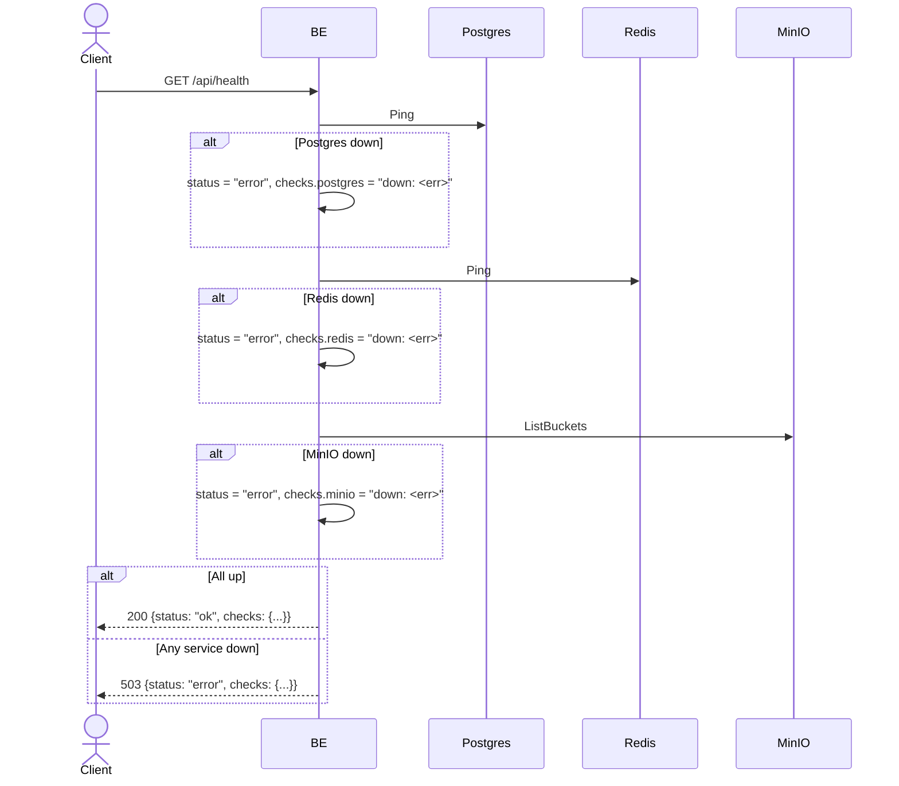

## Overview

This API is used for service health check. The backend checks the Postgres, Redis, and MinIO connections. This endpoint is used by the load balancer / k8s liveness probe / monitoring tool.

---

## Auth

This is a public API, so no authorization header is required.

## Flow



---

## Notes Redis

Action: PING (connection check only, no data read/write).

---

## Notes Postgres/DB

Action: PING via `pgxpool.Pool.Ping()` (connection check only, no query to any table).

---

## Notes MinIO

Action: `ListBuckets()` (connection + permission check only).

---

## Prerequisites

None.

---

## Request Validation

This endpoint does not accept a body or query parameters.

---

## Response

### 200 OK

```json
{
  "status": "ok",
  "checks": {
    "postgres": "up",
    "redis": "up",
    "minio": "up"
  }
}
```

| Field             | Type   | Description                                                |
| ----------------- | ------ | ---------------------------------------------------------- |
| `status`          | string | "ok" if all services are up, "error" if any is down        |
| `checks.postgres` | string | "up" or "down: <error message>"                            |
| `checks.redis`    | string | "up" or "down: <error message>"                            |
| `checks.minio`    | string | "up" or "down: <error message>"                            |

### 503 Service Unavailable

Body is the same as 200 OK but `status` = "error" and one of the checks has a "down: ..." value.

```json
{
  "status": "error",
  "checks": {
    "postgres": "down: dial tcp 127.0.0.1:5435: connect: connection refused",
    "redis": "up",
    "minio": "up"
  }
}
```

---

## Update

This documentation was last updated on 23 May 2026.
