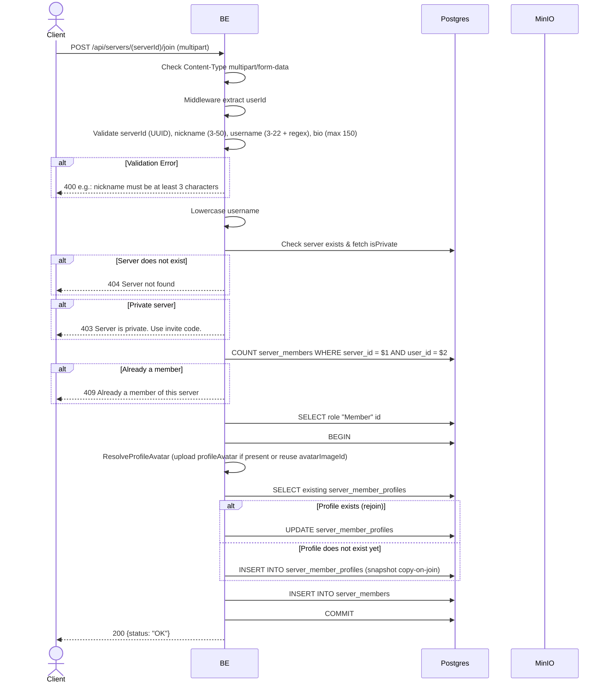

## Overview

This API is used to join a public server directly. The request format is multipart (for uploading the per-server profileAvatar). A private server will be rejected — you must use an invite code. On join, a row is created in `server_members` + a snapshot in `server_member_profiles` (copy-on-join Option B).

---

## Auth

This is a protected API, so it requires the authorization header `Bearer <accessToken>`.

## Flow



---

## Notes Redis

Does not use Redis.

---

## Notes MinIO

If there is a `profileAvatar` upload:
- Bucket: `MINIO_BUCKET_NAME`
- Object key: `profile/avatar/{uuid}.webp`
- Action: PutObject

---

## Notes Postgres/DB

| Table                     | Column                                           | Action        | Notes                                       |
| ------------------------- | ------------------------------------------------ | ------------- | ------------------------------------------- |
| `servers`                 | id, settings                                     | SELECT        | Check exists & isPrivate                    |
| `server_members`          | (count)                                          | SELECT        | Check whether already a member              |
| `server_roles`            | id                                               | SELECT        | Fetch id of role "Member"                   |
| `profile_avatar_images`   | (full)                                           | INSERT        | If there is a profileAvatar upload          |
| `server_member_profiles`  | (full)                                           | INSERT/UPDATE | Snapshot copy-on-join (or update if rejoin) |
| `server_members`          | id, server_id, user_id, server_role_id, joined_at | INSERT        | New membership                              |

---

## Prerequisites

User is already logged in. The target server is public (not private). The user is not yet a member.

---

## Request Validation

Path parameter:

| Field      | Type   | Required | Rules           |
| ---------- | ------ | -------- | --------------- |
| `serverId` | string | yes      | Required, UUID  |

Multipart body:

| Field           | Type          | Required | Rules                                                              |
| --------------- | ------------- | -------- | ------------------------------------------------------------------- |
| `nickname`      | string        | yes      | Required, min 3, max 50                                             |
| `username`      | string        | yes      | Required, min 3, max 22, regex `^[a-zA-Z0-9_.]+$`                   |
| `bio`           | string        | no       | Max 150 characters                                                 |
| `avatarImageId` | string (UUID) | no       | Reuse existing profile_avatar_images UUID owned by the user        |
| `profileAvatar` | file          | no       | New image (jpg/jpeg/png/gif/webp), max 5MB                          |

---

## Response

### 200 OK

```json
{
  "status": "OK"
}
```

### 400 Bad Request

| `error_message`                                                       | Cause                          |
| --------------------------------------------------------------------- | ------------------------------ |
| `Invalid Content-Type header. Endpoint requires multipart/form-data.` | Wrong Content-Type             |
| `serverId is not a valid UUID`                                        | Invalid UUID                   |
| `nickname is required`                                                | Nickname empty                 |
| `nickname must be at least 3 characters`                              | Nickname less than 3           |
| `nickname must be at most 50 characters`                              | Nickname more than 50          |
| `username is required`                                                | Username empty                 |
| `username must be at least 3 characters`                              | Username less than 3           |
| `username must be at most 22 characters`                              | Username more than 22          |
| `Username may only contain letters, digits, underscores and dots`     | Username failed regex          |
| `bio must be at most 150 characters`                                  | Bio more than 150              |

### 403 Forbidden

| `error_message`                          | Cause                               |
| ---------------------------------------- | ----------------------------------- |
| `Server is private. Use invite code.`    | Private server (settings.isPrivate=true) |

### 404 Not Found

| `error_message`        | Cause                 |
| ---------------------- | --------------------- |
| `Server not found`     | Server does not exist |

### 409 Conflict

| `error_message`                                       | Cause                                                                 |
| ----------------------------------------------------- | --------------------------------------------------------------------- |
| `Already a member of this server`                     | User is already a member                                              |
| `Nickname is already taken in this server`            | Collision `idx_server_member_profiles_uk_02` (`server_id, nickname`)  |
| `Username is already taken in this server`            | Collision `idx_server_member_profiles_uk_03` (`server_id, username`)  |
| `You already have a profile in this server`           | Race condition collision `idx_server_member_profiles_uk_01` (rare)    |

### 401 Unauthorized

Standard auth errors.

---

## Update

This documentation was last updated on 23 May 2026.
