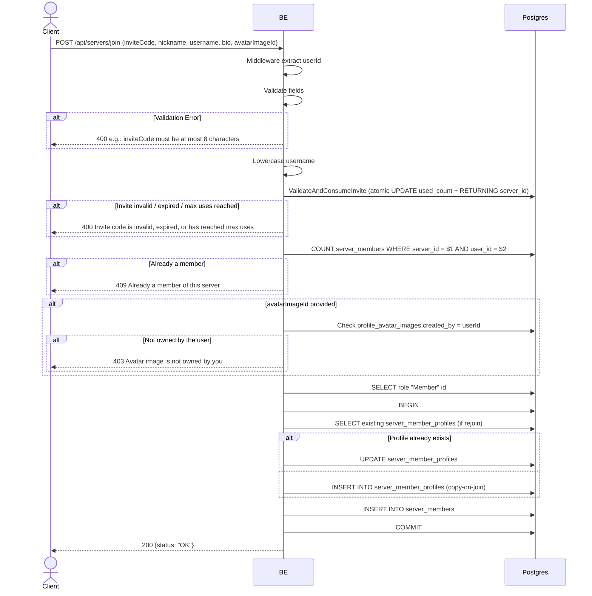

## Overview

This API is used to join a server via invite code (8 characters). The backend validates + atomically increments the invite `used_count` (ValidateAndConsumeInvite). Same as `join_server`, it does copy-on-join per-server profile (Option B).

---

## Auth

This is a protected API, so it requires the authorization header `Bearer <accessToken>`.

## Flow



---

## Notes Redis

Does not use Redis.

---

## Notes Postgres/DB

| Table                     | Column                                 | Action        | Notes                                                   |
| ------------------------- | -------------------------------------- | ------------- | ------------------------------------------------------- |
| `server_invites`          | code, used_count, max_uses, is_active, expires_at | UPDATE | Atomic consume — increment used_count, return server_id |
| `server_members`          | (count)                                | SELECT        | Check already member                                    |
| `profile_avatar_images`   | id, created_by                         | SELECT        | Check ownership of avatarImageId (if provided)          |
| `server_roles`            | id                                     | SELECT        | Fetch role "Member"                                     |
| `server_member_profiles`  | (full)                                 | INSERT/UPDATE | Snapshot copy-on-join                                   |
| `server_members`          | (full)                                 | INSERT        | New membership                                          |

---

## Prerequisites

User is already logged in. Has a valid invite code (8 char, not yet expired, not yet at max-uses).

---

## Request Validation

Body JSON:

| Field           | Type          | Required | Rules                                                              |
| --------------- | ------------- | -------- | ------------------------------------------------------------------- |
| `inviteCode`    | string        | yes      | Required, exactly 8 characters                                      |
| `nickname`      | string        | yes      | Required, min 3, max 50                                             |
| `username`      | string        | yes      | Required, min 3, max 22, regex `^[a-zA-Z0-9_.]+$`                   |
| `bio`           | string        | no       | Max 500 characters                                                  |
| `avatarImageId` | string (UUID) | no       | Reuse existing avatar owned by the user                            |

---

## Response

### 200 OK

```json
{
  "status": "OK"
}
```

### 400 Bad Request

| `error_message`                                                       | Cause                                                      |
| --------------------------------------------------------------------- | ---------------------------------------------------------- |
| `inviteCode is required`                                              | Empty                                                      |
| `inviteCode must be at least 8 characters`                            | Less than 8                                                |
| `inviteCode must be at most 8 characters`                             | More than 8                                                |
| `nickname is required` / `nickname must be at least 3 characters`     | Nickname empty / too short                                 |
| `nickname must be at most 50 characters`                              | Nickname too long                                          |
| `username is required` / `username must be at least 3 characters`     | Username empty / too short                                 |
| `username must be at most 22 characters`                              | Username too long                                          |
| `Username may only contain letters, digits, underscores and dots`     | Username failed regex                                      |
| `bio must be at most 500 characters`                                  | Bio too long                                               |
| `avatarImageId is not a valid UUID`                                   | avatarImageId is not a UUID                                |
| `Invite code is invalid, expired, or has reached max uses`            | Invite failed validate+consume                             |

### 403 Forbidden

| `error_message`                       | Cause                                   |
| ------------------------------------- | --------------------------------------- |
| `Avatar image is not owned by you`    | avatarImageId is not owned by the user  |

### 409 Conflict

| `error_message`                                       | Cause                                                                 |
| ----------------------------------------------------- | --------------------------------------------------------------------- |
| `Already a member of this server`                     | User is already a member                                              |
| `Nickname is already taken in this server`            | Collision `idx_server_member_profiles_uk_02` (`server_id, nickname`)  |
| `Username is already taken in this server`            | Collision `idx_server_member_profiles_uk_03` (`server_id, username`)  |
| `You already have a profile in this server`           | Race condition collision `idx_server_member_profiles_uk_01` (rare)    |

### 401 Unauthorized

Standard auth errors.

---

## Update

This documentation was last updated on 23 May 2026.
