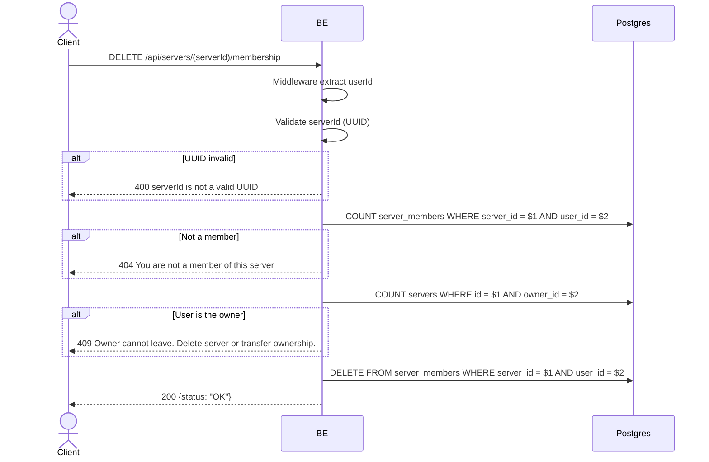

## Overview

This API is used to leave a server. The owner cannot leave — they must delete the server or transfer ownership first. The `server_members` row is hard-deleted, but `server_member_profiles` is retained (historical snapshot).

---

## Auth

This is a protected API, so it requires the authorization header `Bearer <accessToken>`.

## Flow



---

## Notes Redis

Does not use Redis.

---

## Notes Postgres/DB

| Table            | Column             | Action | Notes                                       |
| ---------------- | ------------------ | ------ | ------------------------------------------- |
| `server_members` | (count)            | SELECT | Check whether the user is a member          |
| `servers`        | owner_id           | SELECT | Check whether the user is the owner         |
| `server_members` | server_id, user_id | DELETE | Hard-delete membership                      |

Note: the row in `server_member_profiles` is not deleted along with it — the snapshot is kept for history (see the `get_profile_history` endpoint).

---

## Prerequisites

User is a member of the server (not the owner).

---

## Request Validation

Path parameter:

| Field      | Type   | Required | Rules           |
| ---------- | ------ | -------- | --------------- |
| `serverId` | string | yes      | Required, UUID  |

No body.

---

## Response

### 200 OK

```json
{
  "status": "OK"
}
```

### 400 Bad Request

| `error_message`                  | Cause        |
| -------------------------------- | ------------ |
| `serverId is not a valid UUID`   | Invalid UUID |

### 404 Not Found

| `error_message`                         | Cause               |
| --------------------------------------- | ------------------- |
| `You are not a member of this server`   | User is not a member |

### 409 Conflict

| `error_message`                                              | Cause              |
| ------------------------------------------------------------ | ------------------ |
| `Owner cannot leave. Delete server or transfer ownership.`   | User is the owner  |

### 401 Unauthorized

Standard auth errors.

---

## Update

This documentation was last updated on 23 May 2026.
