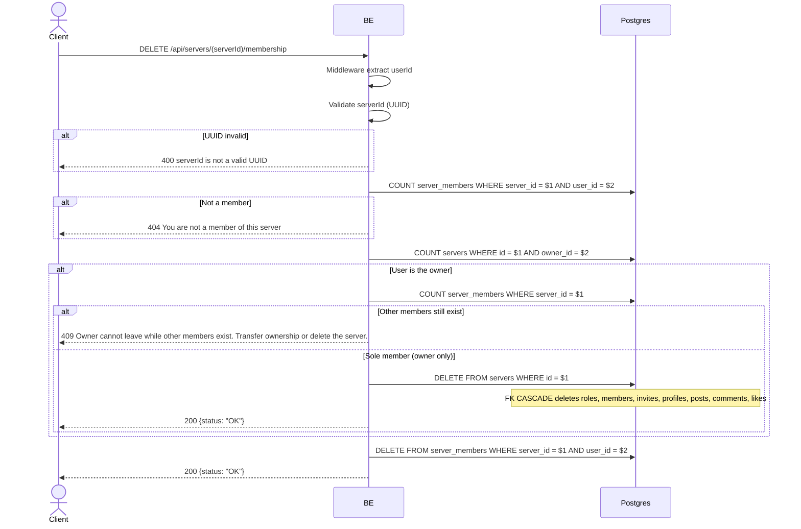

## Overview

This API is used to leave a server. If the owner leaves while other members still exist, the request is rejected (409) — they must transfer ownership or delete the server first. However, if the owner is the sole remaining member, leaving hard-deletes the entire server (FK CASCADE cleans up related rows) and returns 200. For a non-owner member, the `server_members` row is hard-deleted, but `server_member_profiles` is retained (historical snapshot).

---

## Auth

This is a protected API, so it requires the authorization header `Bearer <accessToken>`.

## Flow



---

## Notes Redis

Does not use Redis.

---

## Notes Postgres/DB

| Table            | Column             | Action | Notes                                       |
| ---------------- | ------------------ | ------ | ------------------------------------------- |
| `server_members` | (count)            | SELECT | Check whether the user is a member          |
| `servers`        | owner_id           | SELECT | Check whether the user is the owner         |
| `server_members` | (count)            | SELECT | If owner: count total members in the server |
| `servers`        | id                 | DELETE | If owner is the sole member: hard-delete the whole server (FK CASCADE) |
| `server_members` | server_id, user_id | DELETE | If not owner (or owner not sole member, rejected instead): hard-delete membership |

Note: the row in `server_member_profiles` is not deleted along with a plain membership departure — the snapshot is kept for history (see the `get_profile_history` endpoint). This does not apply when the sole owner leaves, since the whole server (and its profiles) is deleted in that case.

---

## Prerequisites

User is a member of the server. If the user is the owner, they may only leave if they are the sole remaining member (which deletes the server); otherwise they must transfer ownership or delete the server first.

---

## Request Validation

Path parameter:

| Field      | Type   | Required | Rules           |
| ---------- | ------ | -------- | --------------- |
| `serverId` | string | yes      | Required, UUID  |

No body.

---

## Response

### 200 OK

```json
{
  "status": "OK"
}
```

Returned both for a regular member leaving (membership row deleted) and for a sole owner leaving (the whole server is deleted).

### 400 Bad Request

| `error_message`                  | Cause        |
| -------------------------------- | ------------ |
| `serverId is not a valid UUID`   | Invalid UUID |

### 404 Not Found

| `error_message`                         | Cause               |
| --------------------------------------- | ------------------- |
| `You are not a member of this server`   | User is not a member |

### 409 Conflict

| `error_message`                                                                         | Cause                                             |
| ---------------------------------------------------------------------------------------- | -------------------------------------------------- |
| `Owner cannot leave while other members exist. Transfer ownership or delete the server.` | User is the owner and other members still exist   |

### 401 Unauthorized

Standard auth errors.

---

## Update

This documentation was last updated on 20 July 2026.
