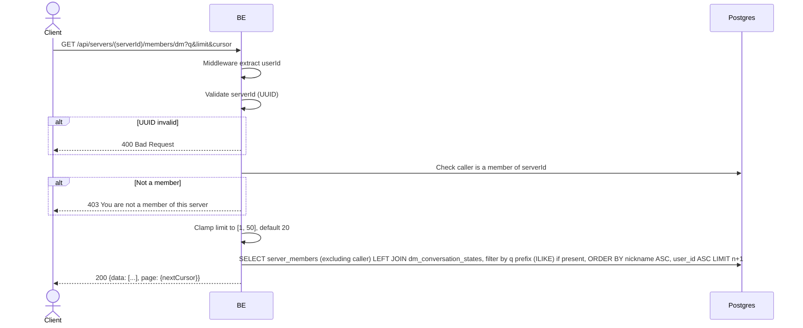

## Overview

This API lists the other members of a server that the caller can start a direct message with — used to power a "new DM" / member picker UI. Supports an optional prefix search on nickname/username and cursor-based pagination. For each member it also returns the existing conversation id (if any) plus unread count and last message preview, so the same list can double as a merged "contacts + recent DMs" view.

---

## Auth

This is a protected API, so it requires the authorization header `Bearer <accessToken>`.

## Flow



---

## Notes Redis

Does not use Redis.

---

## Notes Postgres/DB

| Table                      | Column                                                              | Action | Notes                                                                       |
| ---------------------------- | -------------------------------------------------------------------------- | ------ | --------------------------------------------------------------------------------- |
| `server_members`           | user_id                                                                      | SELECT | All members of `serverId` except the caller (`user_id <> callerId`)               |
| `server_member_profiles`   | nickname, username                                                            | SELECT | Per-server identity, joined per member                                             |
| `profile_avatar_images`    | object_key                                                                    | SELECT | Avatar (left join)                                                                  |
| `dm_conversation_states`   | conversation_id, unread_count, last_message_preview, last_message_at         | SELECT | Left join on `(server_id, user_id=caller, peer_user_id=member)` — `null` if no conversation exists yet with that member |

Search (`q`) matches `nickname ILIKE 'q%' OR username ILIKE 'q%'` (prefix match, case-insensitive). Ordering and the pagination cursor are both based on `(nickname, user_id)`, not on conversation recency.

---

## Prerequisites

Caller must be a member of `serverId`.

---

## Request Validation

Path parameter:

| Field      | Type   | Required | Rules           |
| ---------- | ------ | -------- | --------------- |
| `serverId` | string | yes      | Required, UUID  |

Query parameter:

| Field    | Type   | Required | Rules                                                     |
| -------- | ------ | -------- | -------------------------------------------------------------- |
| `q`      | string | no       | Prefix filter on nickname/username, no length limit enforced      |
| `limit`  | int    | no       | Defaults to `20`; values `<= 0` fall back to the default, values `> 50` are clamped to `50` |
| `cursor` | string | no       | Opaque cursor from a previous response's `page.nextCursor`; decoded on a best-effort basis |

---

## Response

### 200 OK

```json
{
  "data": [
    {
      "userId": "peer-user-uuid",
      "identity": {
        "nickname": "GamerX",
        "username": "gamerx",
        "avatarUrl": null
      },
      "conversationId": null,
      "unreadCount": 0,
      "lastMessagePreview": null,
      "lastMessageAt": null
    }
  ],
  "page": {
    "nextCursor": "base64-cursor-or-empty"
  }
}
```

| Field              | Type        | Description                                                          |
| --------------------- | ----------- | ------------------------------------------------------------------------ |
| `conversationId`     | string/null | Existing conversation with this member, or `null` if none has been created yet |
| `unreadCount`        | int         | Caller's unread count for that conversation (`0` if `conversationId` is `null`) |

### 400 Bad Request

| `error_message`                | Cause        |
| ------------------------------- | ------------ |
| `serverId is not a valid UUID`  | Invalid UUID |

### 403 Forbidden

| `error_message`                        | Cause        |
| ---------------------------------------- | ------------ |
| `You are not a member of this server`    | Not a member |

### 401 Unauthorized

Standard auth errors.

---

## Update

This documentation was last updated on 20 July 2026.
