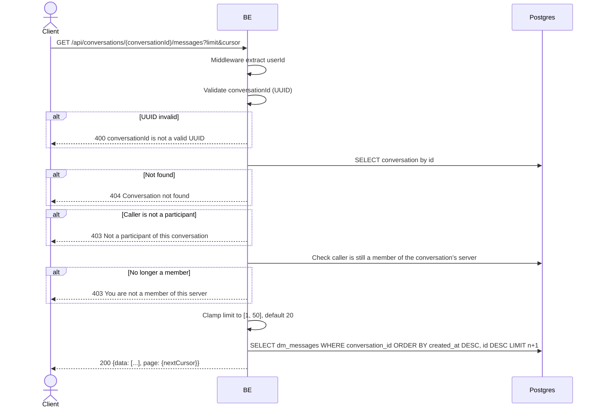

## Overview

This API lists the messages in a conversation, newest first, for backward/infinite-scroll pagination (the client walks further into history by passing the cursor from the previous page).

---

## Auth

This is a protected API, so it requires the authorization header `Bearer <accessToken>`.

## Flow



---

## Notes Redis

Does not use Redis.

---

## Notes Postgres/DB

| Table                     | Column                                                          | Action | Notes                                                    |
| --------------------------- | ---------------------------------------------------------------------- | ------ | ---------------------------------------------------------- |
| `dm_conversations`        | (lookup)                                                                  | SELECT | Fetch conversation to check participant + server membership |
| `server_members`          | (count)                                                                    | SELECT | Re-check the caller is still a member of the server           |
| `dm_messages`             | id, sender_id, type, content, client_message_id, created_at              | SELECT | Newest-first, cursor + limit                                    |
| `server_member_profiles`  | nickname, username                                                        | SELECT | Sender identity (left join)                                     |
| `profile_avatar_images`   | object_key                                                                | SELECT | Sender avatar (left join)                                        |

---

## Prerequisites

Caller must be one of the two participants of `conversationId`, and must still be a member of the server the conversation belongs to.

---

## Request Validation

Path parameter:

| Field             | Type   | Required | Rules           |
| ------------------- | ------ | -------- | --------------- |
| `conversationId`   | string | yes      | Required, UUID  |

Query parameter:

| Field    | Type   | Required | Rules                                                     |
| -------- | ------ | -------- | -------------------------------------------------------------- |
| `limit`  | int    | no       | Defaults to `20`; values `<= 0` fall back to the default, values `> 50` are clamped to `50` |
| `cursor` | string | no       | Opaque cursor from a previous response's `page.nextCursor`; decoded on a best-effort basis |

---

## Response

### 200 OK

```json
{
  "data": [
    {
      "id": "message-uuid",
      "conversationId": "conversation-uuid",
      "senderId": "sender-uuid",
      "sender": {
        "nickname": "GamerX",
        "username": "gamerx",
        "avatarUrl": null
      },
      "type": "text",
      "content": "hello!",
      "clientMessageId": "client-generated-uuid",
      "createdAt": "2026-06-01T10:00:00Z"
    }
  ],
  "page": {
    "nextCursor": "base64-cursor-or-empty"
  }
}
```

Messages are ordered newest first (`createdAt DESC`); to page further back in history, pass `page.nextCursor` as the next request's `cursor`.

### 400 Bad Request

| `error_message`                    | Cause        |
| -------------------------------------- | ------------ |
| `conversationId is not a valid UUID`  | Invalid UUID |

### 403 Forbidden

| `error_message`                            | Cause                                                  |
| ---------------------------------------------- | ------------------------------------------------------------ |
| `Not a participant of this conversation`      | Caller is not a participant of the conversation                 |
| `You are not a member of this server`         | Caller has since left the server the conversation belongs to      |

### 404 Not Found

| `error_message`             | Cause                        |
| -------------------------------- | ---------------------------------- |
| `Conversation not found`        | `conversationId` does not exist     |

### 401 Unauthorized

Standard auth errors.

---

## Update

This documentation was last updated on 20 July 2026.
