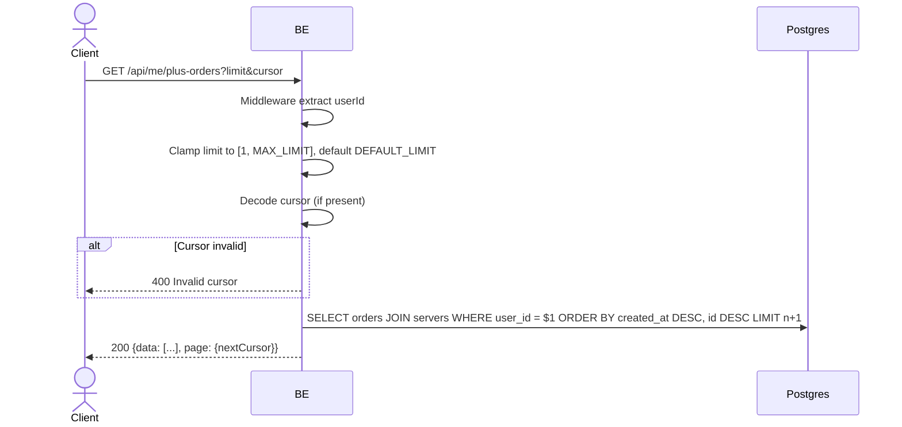

## Overview

This API lists the calling user's own Virdan Plus purchase history across all servers, newest first. Cursor-based pagination.

---

## Auth

This is a protected API, so it requires the authorization header `Bearer <accessToken>`.

## Flow



---

## Notes Redis

Does not use Redis.

---

## Notes Postgres/DB

| Table                | Column                                                                      | Action | Notes                                       |
| --------------------- | ------------------------------------------------------------------------------ | ------ | ------------------------------------------------ |
| `server_plus_orders`  | id, server_id, total_idr, status, paid_at, plus_expires_at, created_at         | SELECT | Orders belonging to the caller, cursor + limit    |
| `servers`             | name                                                                            | SELECT | Joined in for `serverName`                        |

---

## Prerequisites

None beyond authentication — every user can list their own orders.

---

## Request Validation

Query parameter:

| Field    | Type   | Required | Rules                                             |
| -------- | ------ | -------- | -------------------------------------------------- |
| `limit`  | int    | no       | Defaults to `10`; values `<= 0` or `> 20` fall back to the default (invalid values are silently clamped, not rejected) |
| `cursor` | string | no       | Opaque cursor from a previous response's `page.nextCursor` |

No path parameter, no body.

---

## Response

### 200 OK

```json
{
  "data": [
    {
      "id": "order-uuid",
      "serverId": "server-uuid",
      "serverName": "My Community",
      "totalIdr": 55500,
      "status": "PAID",
      "paidAt": "2026-06-01T10:00:00Z",
      "plusExpiresAt": "2026-07-01T10:00:00Z",
      "createdAt": "2026-06-01T09:59:00Z"
    }
  ],
  "page": {
    "nextCursor": "base64-cursor-or-empty"
  }
}
```

| Field           | Type        | Description                                        |
| --------------- | ----------- | --------------------------------------------------- |
| `status`        | string      | `PENDING`, `PAID`, or `FAILED`                       |
| `paidAt`        | string/null | Set once the order transitions to `PAID`             |
| `plusExpiresAt` | string/null | Set once the order transitions to `PAID`              |

An empty list is returned (not an error) if the caller has never purchased Virdan Plus.

### 400 Bad Request

| `error_message`     | Cause            |
| -------------------- | ---------------- |
| `Invalid cursor`     | Corrupted cursor |

### 401 Unauthorized

Standard auth errors.

---

## Update

This documentation was last updated on 20 July 2026.
