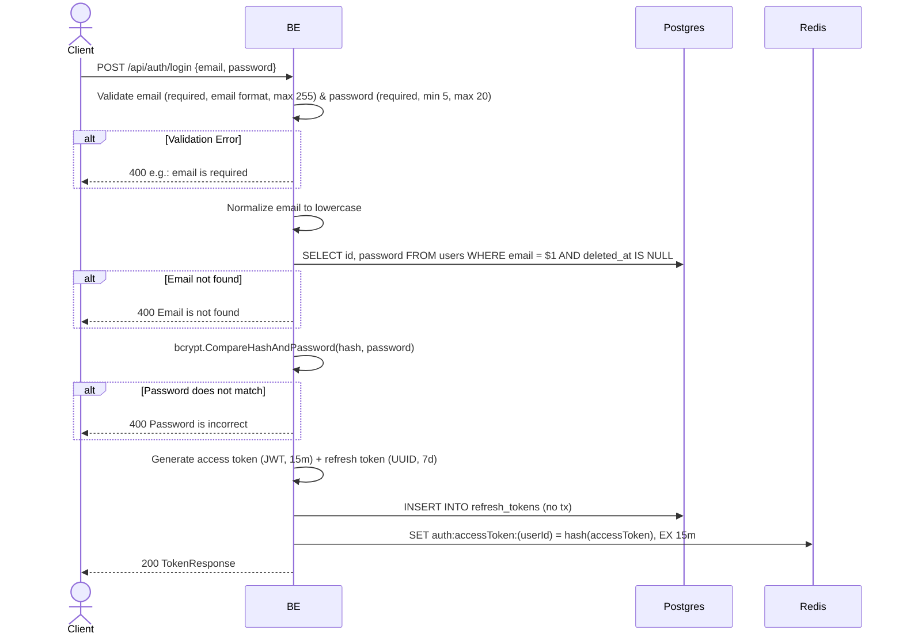

## Overview

This API is used to log in with email and password. The backend checks that the email exists + the password matches (bcrypt), then generates a token pair (access JWT + refresh UUID).

---

## Auth

This is a public API, so no authorization header is required.

## Flow



---

## Notes Redis

1. auth access token:
   key: `auth:accessToken:(userId)`
   value: SHA256 hash of access token
   ttl: 15 minutes

---

## Notes Postgres/DB

| Table            | Column       | Action | Notes                                            |
| ---------------- | ------------ | ------ | ------------------------------------------------ |
| `users`          | id, password | SELECT | Check email exists + fetch password hash for bcrypt |
| `refresh_tokens` | id           | INSERT | UUID primary key refresh token                   |
| `refresh_tokens` | user_id      | INSERT | Refresh token owner                              |
| `refresh_tokens` | token_hash   | INSERT | SHA256 hash of refresh token                     |
| `refresh_tokens` | token_family | INSERT | UUID family for rotation strategy                |
| `refresh_tokens` | expires_at   | INSERT | now + 7 days                                     |
| `refresh_tokens` | created_at   | INSERT | UTC now                                          |
| `refresh_tokens` | updated_at   | INSERT | UTC now                                          |
| `refresh_tokens` | created_by   | INSERT | userId                                           |
| `refresh_tokens` | updated_by   | INSERT | userId                                           |

---

## Prerequisites

None. The endpoint can be called under any condition.

---

## Request Validation

| Field      | Type   | Required | Rules                                                |
| ---------- | ------ | -------- | ----------------------------------------------------- |
| `email`    | string | yes      | Required, valid email format, max 255 characters      |
| `password` | string | yes      | Required, min 5 characters, max 20 characters         |

The email is automatically lowercased after validation.

---

## Response

### 200 OK

```json
{
  "accessToken": "eyJhbGciOiJIUzI1NiIsInR5cCI6IkpXVCJ9...",
  "accessTokenExpiresIn": 900,
  "refreshToken": "550e8400-e29b-41d4-a716-446655440000",
  "refreshTokenExpiresIn": 604800,
  "tokenType": "Bearer"
}
```

| Field                   | Type   | Description                                     |
| ----------------------- | ------ | ----------------------------------------------- |
| `accessToken`           | string | JWT access token                                |
| `accessTokenExpiresIn`  | int    | Access token TTL in seconds (900 = 15 minutes)  |
| `refreshToken`          | string | UUID refresh token                              |
| `refreshTokenExpiresIn` | int    | Refresh token TTL in seconds (604800 = 7 days)  |
| `tokenType`             | string | Always "Bearer"                                 |

### 400 Bad Request

| `error_message`                       | Cause                          |
| ------------------------------------- | ------------------------------ |
| `email is required`                   | Email empty                    |
| `email must be a valid email address` | Invalid email format           |
| `email must be at most 255 characters`| Email more than 255 characters |
| `password is required`                | Password empty                 |
| `password must be at least 5 characters` | Password less than 5        |
| `password must be at most 20 characters` | Password more than 20       |
| `Email is not found`                  | Email not registered           |
| `Password is incorrect`               | Wrong password                 |

---

## Update

This documentation was last updated on 23 May 2026.
