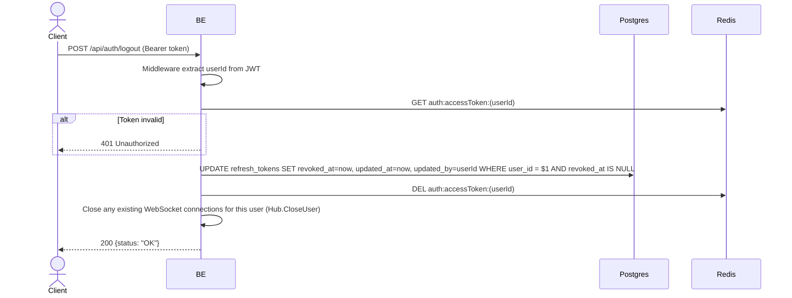

## Overview

This API is used to log out. The backend revokes ALL of the user's refresh tokens and deletes the access token cache in Redis. After logout, the user must log in again.

---

## Auth

This is a protected API, so it requires the authorization header `Bearer <accessToken>`.

## Flow



---

## Notes Redis

1. auth access token:
   key: `auth:accessToken:(userId)`
   action: DEL

---

## Notes Postgres/DB

| Table            | Column     | Action | Notes                                               |
| ---------------- | ---------- | ------ | --------------------------------------------------- |
| `refresh_tokens` | revoked_at | UPDATE | Set revoke timestamp for all of the user's active tokens |
| `refresh_tokens` | updated_at | UPDATE | UTC now                                             |
| `refresh_tokens` | updated_by | UPDATE | userId performing the logout                        |

---

## Prerequisites

The user is already logged in and has a valid access token.

---

## Request Validation

This endpoint does not accept a body. Authentication is via the `Authorization: Bearer <accessToken>` header.

---

## Response

### 200 OK

```json
{
  "status": "OK"
}
```

### 401 Unauthorized

| `error_message`                              | Cause                                   |
| -------------------------------------------- | --------------------------------------- |
| `Authorization header is missing`            | Header not present                      |
| `Invalid authorization scheme`               | Bearer prefix not used                  |
| `Authentication token is expired`            | JWT already expired                     |
| `Authentication token is invalid`            | JWT invalid                             |
| `Authorization token not found or expired`   | Token not present in the Redis cache    |

---

## Update

This documentation was last updated on 20 July 2026.
