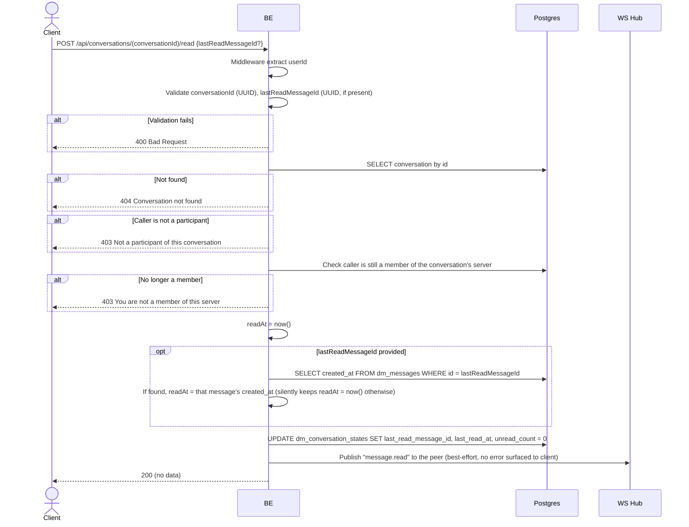

## Overview

This API marks a conversation as read for the caller: it resets their unread counter to zero and records a read cursor. It also notifies the peer over their live WebSocket connection (if any) that their messages have been read, so the peer's client can show a "seen" indicator.

---

## Auth

This is a protected API, so it requires the authorization header `Bearer <accessToken>`.

## Flow

---

## Notes Redis

Does not use Redis. The read-receipt fanout goes through the in-process WebSocket hub — see `websocket_realtime.md`.

---

## Notes Postgres/DB

| Table                     | Column                                          | Action | Notes                                                                     |
| --------------------------- | ------------------------------------------------------ | ------ | -------------------------------------------------------------------------------- |
| `dm_conversations`        | (lookup)                                                  | SELECT | Fetch conversation to check participant + server membership                       |
| `server_members`          | (count)                                                    | SELECT | Re-check the caller is still a member of the server                                |
| `dm_messages`             | created_at                                                | SELECT | Only run if `lastReadMessageId` is provided, to timestamp the read cursor accurately |
| `dm_conversation_states`  | last_read_message_id, last_read_at, unread_count         | UPDATE | Row for `(conversationId, callerId)`; `unread_count` reset to `0`                    |

---

## Prerequisites

Caller must be one of the two participants of `conversationId`, and must still be a member of the server the conversation belongs to.

---

## Request Validation

Path parameter:

| Field             | Type   | Required | Rules           |
| ------------------- | ------ | -------- | --------------- |
| `conversationId`   | string | yes      | Required, UUID  |

JSON body:

| Field                | Type          | Required | Rules                                                                 |
| ---------------------- | ------------- | -------- | -------------------------------------------------------------------------- |
| `lastReadMessageId`    | string/null   | no       | UUID if present. If omitted or the message id isn't found, the read timestamp simply falls back to "now" instead of erroring |

---

## Response

### 200 OK

No response body (`{"status":"OK"}`-style empty success envelope).

### 400 Bad Request

| `error_message`                        | Cause                        |
| ------------------------------------------ | ---------------------------------- |
| `conversationId is not a valid UUID`      | Invalid `conversationId`             |
| `lastReadMessageId is not a valid UUID`   | Invalid `lastReadMessageId` (when provided) |

### 403 Forbidden

| `error_message`                            | Cause                                                  |
| ---------------------------------------------- | ------------------------------------------------------------ |
| `Not a participant of this conversation`      | Caller is not a participant of the conversation                 |
| `You are not a member of this server`         | Caller has since left the server the conversation belongs to      |

### 404 Not Found

| `error_message`             | Cause                        |
| -------------------------------- | ---------------------------------- |
| `Conversation not found`        | `conversationId` does not exist     |

### 401 Unauthorized

Standard auth errors.

---

## Update

This documentation was last updated on 20 July 2026.
