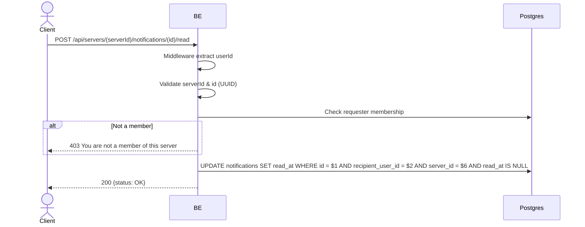

## Overview

Marks a single notification as read. Nested under the server (per-server). The requester must be a member, and the notification must belong to the requester in that server.

---

## Auth

Protected API — requires header `Bearer <accessToken>`.

## Flow



---

## Notes Redis

Does not use Redis.

---

## Notes Postgres/DB

| Table            | Column                            | Action | Notes                                              |
| ---------------- | --------------------------------- | ------ | -------------------------------------------------- |
| `server_members` | (count)                           | SELECT | Check requester membership                         |
| `notifications`  | id, recipient_user_id, server_id  | UPDATE | Set read_at; scoped recipient + server, guard NULL |

---

## Prerequisites

The requester is a member of the server; the notification belongs to the requester.

---

## Request Validation

| Field      | Type   | Required | Rules          |
| ---------- | ------ | -------- | -------------- |
| `serverId` | string | yes      | Required, UUID |
| `id`       | string | yes      | Required, UUID |

---

## Response

### 200 OK

```json
{ "status": "OK" }
```

### 400 Bad Request

Invalid UUID (serverId / id).

### 403 Forbidden

| `error_message`                       | Cause                  |
| ------------------------------------- | ---------------------- |
| `You are not a member of this server` | Requester not a member |

### 401 Unauthorized

Standard auth errors.

---

## Update

Created on 1 June 2026 (per-server notifications).
