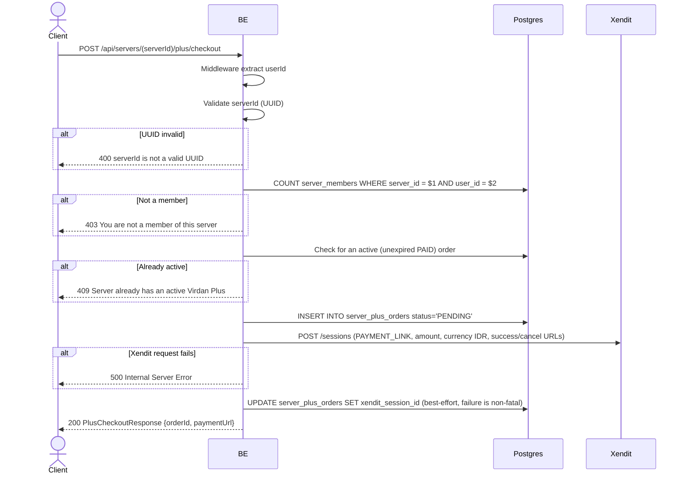

## Overview

This API starts a Virdan Plus purchase for a server: it creates a `PENDING` order row and opens a hosted payment session with Xendit, returning a payment link the client should redirect the user to. The order is only marked `PAID` later, asynchronously, when Xendit calls the webhook (see `xendit_webhook.md`) after the user actually completes payment.

---

## Auth

This is a protected API, so it requires the authorization header `Bearer <accessToken>`.

## Flow



---

## Notes Redis

Does not use Redis.

---

## Notes Postgres/DB

| Table                | Column                                                     | Action | Notes                                                       |
| --------------------- | ----------------------------------------------------------- | ------ | -------------------------------------------------------------- |
| `server_members`      | (count)                                                       | SELECT | Check membership                                                |
| `server_plus_orders`  | plus_expires_at                                               | SELECT | Reject if server already has an active subscription             |
| `server_plus_orders`  | id, server_id, user_id, reference_id, base/tax/total_idr, status | INSERT | New order, `status='PENDING'`, `reference_id = "virdan-plus-{orderId}"` |
| `server_plus_orders`  | xendit_session_id                                             | UPDATE | Attach the Xendit session id once created (best-effort; a failure here does not fail the request) |

---

## Notes External API (Xendit)

- `POST {XENDIT_API_BASE_URL}/sessions`, Basic Auth with `XENDIT_SECRET_KEY`.
- Body: `session_type: "PAY"`, `mode: "PAYMENT_LINK"`, `amount`, `currency: "IDR"`, `country: "ID"`, `success_return_url`, `cancel_return_url`, `description: "Virdan Plus (30 days)"`.
- Response used: `payment_session_id` (stored as `xendit_session_id`) and `payment_link_url` (returned to the client as `paymentUrl`).

---

## Prerequisites

Caller must be a member of the target server, and the server must not already have an active Virdan Plus subscription.

---

## Request Validation

Path parameter:

| Field      | Type   | Required | Rules           |
| ---------- | ------ | -------- | --------------- |
| `serverId` | string | yes      | Required, UUID  |

No body.

---

## Response

### 200 OK

```json
{
  "orderId": "order-uuid",
  "paymentUrl": "https://checkout.xendit.co/..."
}
```

| Field        | Type   | Description                                  |
| ------------ | ------ | --------------------------------------------- |
| `orderId`    | string | Newly created order UUID                       |
| `paymentUrl` | string | Xendit hosted payment link to redirect the user to |

### 400 Bad Request

| `error_message`                | Cause        |
| ------------------------------- | ------------ |
| `serverId is not a valid UUID`  | Invalid UUID |

### 403 Forbidden

| `error_message`                        | Cause        |
| ---------------------------------------- | ------------ |
| `You are not a member of this server`    | Not a member |

### 409 Conflict

| `error_message`                              | Cause                                       |
| ----------------------------------------------- | ---------------------------------------------- |
| `Server already has an active Virdan Plus`      | The server already has an unexpired `PAID` order |

### 401 Unauthorized

Standard auth errors.

### 500 Internal Server Error

Returned if the call to Xendit's session API fails (network error, non-2xx response, or a malformed response missing `payment_link_url`). The `PENDING` order row created just before this call is **not** rolled back — a stuck `PENDING` order with no session id will simply never transition to `PAID` since no webhook will ever reference it.

---

## Update

This documentation was last updated on 20 July 2026.
