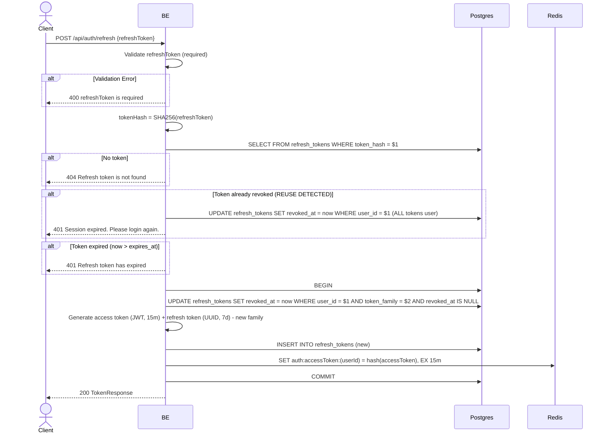

## Overview

This API is used to rotate the access token + refresh token. It will revoke the old refresh token family and generate a new pair. If a refresh token that has already been revoked is used again (token reuse), the system treats it as theft and revokes ALL of the user's tokens (security escalation).

---

## Auth

This is a public API, so no authorization header is required. What is required: a body with a valid `refreshToken`.

## Flow



---

## Notes Redis

1. auth access token:
   key: `auth:accessToken:(userId)`
   value: SHA256 hash of new access token
   ttl: 15 minutes

---

## Notes Postgres/DB

| Table            | Column        | Action | Notes                                                                     |
| ---------------- | ------------- | ------ | ------------------------------------------------------------------------- |
| `refresh_tokens` | (all)         | SELECT | Find refresh token by token_hash                                          |
| `refresh_tokens` | revoked_at    | UPDATE | Revoke old token family (or ALL of the user's tokens if reuse detected)   |
| `refresh_tokens` | updated_at    | UPDATE | UTC now                                                                   |
| `refresh_tokens` | updated_by    | UPDATE | userId                                                                    |
| `refresh_tokens` | id, ...       | INSERT | New refresh token with a new family UUID                                  |

---

## Prerequisites

The user has an active refresh token (not yet expired, not yet revoked).

---

## Request Validation

| Field          | Type   | Required | Rules                |
| -------------- | ------ | -------- | -------------------- |
| `refreshToken` | string | yes      | Required, not empty  |

---

## Response

### 200 OK

```json
{
  "accessToken": "eyJhbGciOiJIUzI1NiIsInR5cCI6IkpXVCJ9...",
  "accessTokenExpiresIn": 900,
  "refreshToken": "new-uuid-refresh-token",
  "refreshTokenExpiresIn": 604800,
  "tokenType": "Bearer"
}
```

### 400 Bad Request

| `error_message`            | Cause                     |
| -------------------------- | ------------------------- |
| `refreshToken is required` | Refresh token empty       |

### 401 Unauthorized

| `error_message`                          | Cause                                                                   |
| ---------------------------------------- | ----------------------------------------------------------------------- |
| `Session expired. Please login again.`   | An already-revoked token was used again (token theft escalation - ALL revoked) |
| `Refresh token has expired`              | Refresh token has passed its expiry (7 days)                            |

### 404 Not Found

| `error_message`                | Cause                                          |
| ------------------------------ | ---------------------------------------------- |
| `Refresh token is not found`   | token_hash not found in the refresh_tokens table |

---

## Update

This documentation was last updated on 23 May 2026.
