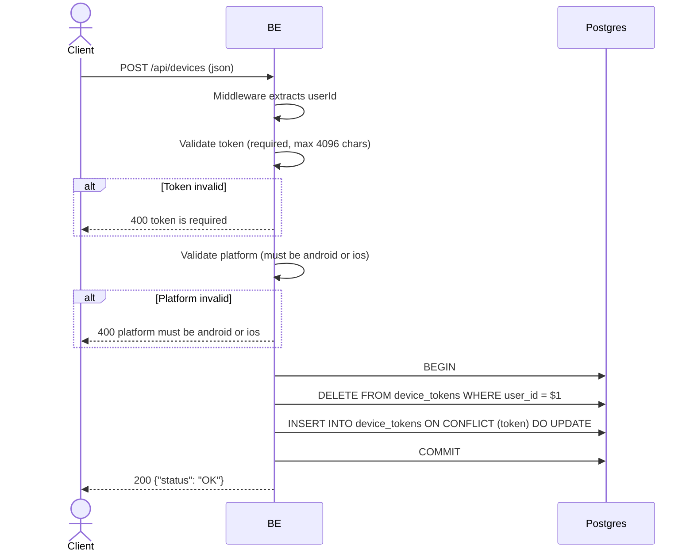

## Overview

Registers an FCM device token after login or signup completes. The token is stored in `device_tokens` and used to deliver push notifications to the user's device. Only one active token is allowed per user — all previous tokens are deleted on each registration.

---

## Auth

Protected endpoint — requires `Bearer <accessToken>` authorization header.

---

## Flow



---

## Notes Postgres/DB

| Table           | Columns                                            | Action        | Description                                    |
| --------------- | -------------------------------------------------- | ------------- | ---------------------------------------------- |
| `device_tokens` | user_id                                            | DELETE        | Delete all existing tokens for this user       |
| `device_tokens` | id, user_id, token, platform, created_at, ...      | INSERT/UPSERT | Store new token, reassign user_id on conflict  |

---

## Request Validation

JSON body:

| Field      | Type   | Required | Rules                           |
| ---------- | ------ | -------- | ------------------------------- |
| `token`    | string | yes      | Required, max 4096 characters   |
| `platform` | string | yes      | Must be `android` or `ios`      |

---

## Response

### 200 OK

```json
{
  "status": "OK"
}
```

### 400 Bad Request

| `error_message`                          | Cause                       |
| ---------------------------------------- | --------------------------- |
| `token is required`                      | Token is empty              |
| `token must be at most 4096 characters`  | Token too long              |
| `platform must be android or ios`        | Invalid platform value      |

### 401 Unauthorized

Standard auth errors.

---

## Updated

Documentation updated on May 30, 2026.
