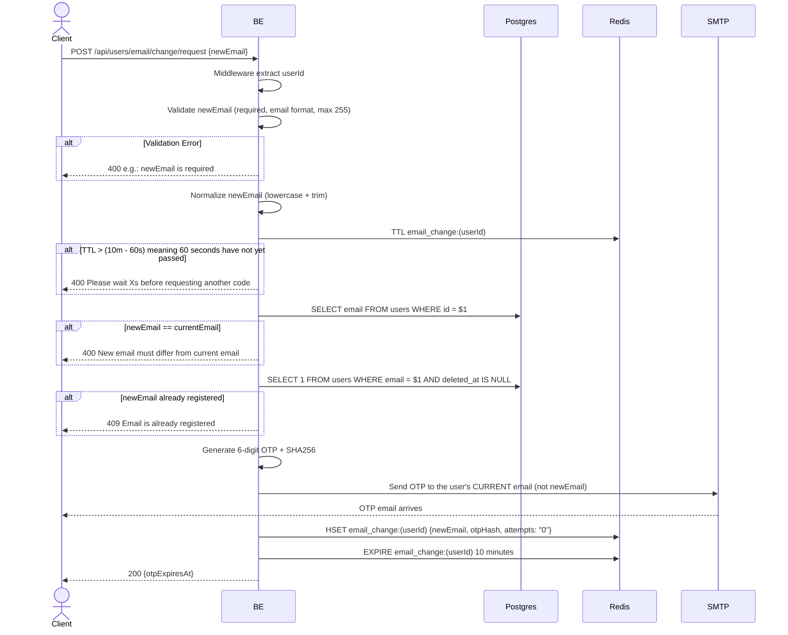

## Overview

This API is used to request an email change. The backend sends an OTP to the **old** email (current email) — not to the new email — to prevent an attacker who has the password from taking over the account by changing the email.

Rate limit: a new request is only allowed once the previous session has passed the 60-second cooldown (TTL 10 minutes, so wait until after 9 minutes before you can request again). Max 5 attempts within 1 session.

---

## Auth

This is a protected API, so it requires the authorization header `Bearer <accessToken>`.

## Flow



---

## Notes Redis

1. email change session:
   key: `email_change:(userId)`
   type: HASH
   ttl: 10 minutes
   fields:
   - `newEmail`
   - `otpHash` (SHA256)
   - `attempts` = "0"

---

## Notes Postgres/DB

| Table   | Column | Action | Notes                                                       |
| ------- | ------ | ------ | ----------------------------------------------------------- |
| `users` | email  | SELECT | Fetch the user's current email to be compared & sent the OTP |
| `users` | email  | SELECT | Check whether newEmail is already used by another user (unique check) |

---

## Prerequisites

The user is already logged in with a valid access token.

---

## Request Validation

| Field      | Type   | Required | Rules                                                        |
| ---------- | ------ | -------- | ------------------------------------------------------------ |
| `newEmail` | string | yes      | Required, valid email format, max 255, different from current email |

---

## Response

### 200 OK

```json
{
  "otpExpiresAt": 1714829400
}
```

| Field          | Type  | Description                                        |
| -------------- | ----- | -------------------------------------------------- |
| `otpExpiresAt` | int64 | Unix timestamp OTP expiry (10 minutes from now)    |

### 400 Bad Request

| `error_message`                                  | Cause                                               |
| ------------------------------------------------ | --------------------------------------------------- |
| `newEmail is required`                           | newEmail empty                                      |
| `newEmail must be a valid email address`         | Invalid email format                                |
| `newEmail must be at most 255 characters`        | Email more than 255 characters                      |
| `Please wait Xs before requesting another code`  | 60-second cooldown has not yet passed               |
| `New email must differ from current email`       | newEmail is the same as the current email           |

### 409 Conflict

| `error_message`                | Cause                                             |
| ------------------------------ | ------------------------------------------------- |
| `Email is already registered`  | newEmail is already used by another user          |

### 401 Unauthorized

| `error_message`                              | Cause              |
| -------------------------------------------- | ------------------ |
| `Authorization header is missing`            | Header not present |
| `Authentication token is invalid`            | JWT invalid        |

---

## Update

This documentation was last updated on 23 May 2026.
