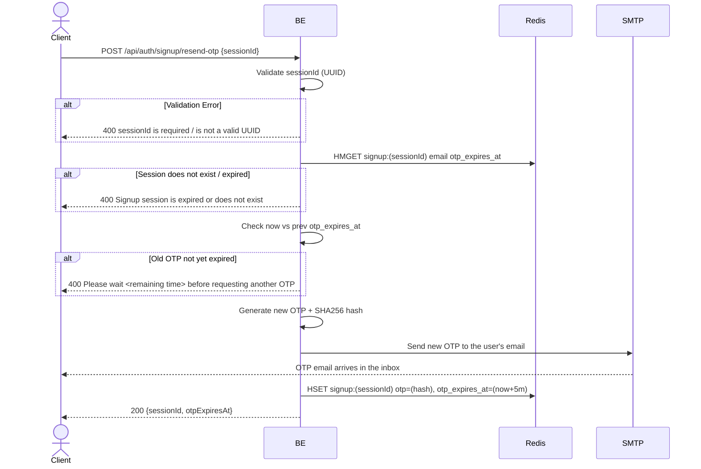

## Overview

This API is used to request resending a signup OTP. It can only be called if the previous OTP has already expired (there is no specific cooldown, but the previous OTP must have passed `otp_expires_at`).

---

## Auth

This is a public API, so no authorization header is required. But it requires a valid `sessionId` from the `start_signup` step.

## Flow



---

## Notes Redis

1. signup session:
   key: `signup:(sessionId)`
   type: HASH

| Field            | Action | Notes                                       |
| ---------------- | ------ | ------------------------------------------- |
| `email`          | HMGET  | Fetched to resend the email                 |
| `otp_expires_at` | HMGET  | Check whether the old OTP is still valid    |
| `otp`            | HSET   | Update with the new OTP hash                |
| `otp_expires_at` | HSET   | Update to a unix timestamp (now + 5 minutes) |

---

## Notes Postgres/DB

This endpoint does not access Postgres.

---

## Prerequisites

- The user must have already hit `start_signup` and have an active `sessionId`.
- The previous OTP has already expired (if not, you will get a message to wait a number of seconds/minutes).

---

## Request Validation

| Field       | Type   | Required | Rules                      |
| ----------- | ------ | -------- | -------------------------- |
| `sessionId` | string | yes      | Required, must be a valid UUID |

---

## Response

### 200 OK

```json
{
  "sessionId": "550e8400-e29b-41d4-a716-446655440000",
  "otpExpiresAt": 1714829700
}
```

| Field          | Type   | Description                                     |
| -------------- | ------ | ----------------------------------------------- |
| `sessionId`    | string | UUID session (same as before)                   |
| `otpExpiresAt` | int64  | Unix timestamp of the new OTP expiry (5 minutes) |

### 400 Bad Request

| `error_message`                                                  | Cause                                                 |
| ---------------------------------------------------------------- | ----------------------------------------------------- |
| `sessionId is required`                                          | Session id empty                                      |
| `sessionId is not a valid UUID`                                  | sessionId format is not a UUID                        |
| `Signup session is expired or does not exist`                    | Session no longer exists in Redis                     |
| `Please wait <remaining time> before requesting another OTP`     | Old OTP is still active. Remaining time format: `X seconds`, `X minutes`, or `X minutes and Y seconds` (per `util.FormatRemainingTime`) |

---

## Update

This documentation was last updated on 23 May 2026.
