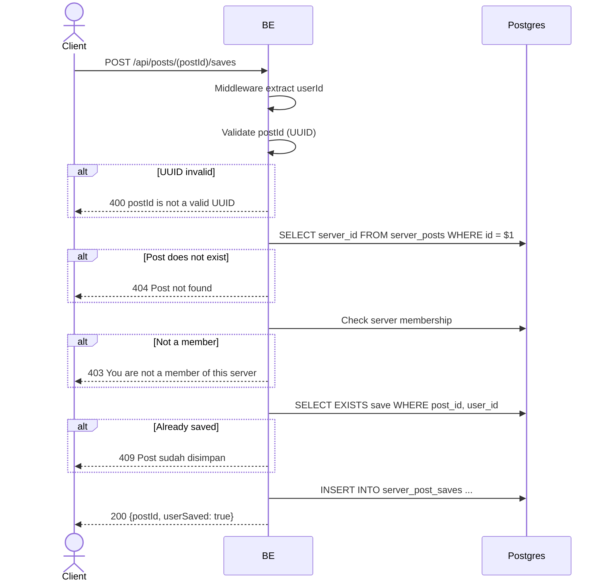

## Overview

This API is used to save (bookmark) a post to the user's private saved list. Save is private, per-server, and does not send a notification to the post owner. If the post is already saved, it returns `409 Post sudah disimpan` (explicit validation, not idempotent). Returns `userSaved: true`.

---

## Auth

This is a protected API, so it requires the authorization header `Bearer <accessToken>`.

## Flow



---

## Notes Redis

Does not use Redis.

---

## Notes Postgres/DB

| Table                | Column                                 | Action | Notes                                               |
| -------------------- | -------------------------------------- | ------ | --------------------------------------------------- |
| `server_posts`       | server_id                              | SELECT | Fetch server_id for the membership check            |
| `server_members`     | (count)                                | SELECT | Check membership                                    |
| `server_post_saves`  | (exists)                               | SELECT | Check whether already saved (reject duplicate)      |
| `server_post_saves`  | id, post_id, user_id, created_at, ... | INSERT | Insert new save. Unique index (post_id, user_id) as safety net |

---

## Prerequisites

User is a member of the server where the post resides.

---

## Request Validation

Path parameter:

| Field    | Type   | Required | Rules           |
| -------- | ------ | -------- | --------------- |
| `postId` | string | yes      | Required, UUID  |

No body.

---

## Response

### 200 OK

```json
{
  "postId": "post-uuid",
  "userSaved": true
}
```

| Field       | Type   | Description                                     |
| ----------- | ------ | ----------------------------------------------- |
| `postId`    | string | Post UUID                                       |
| `userSaved` | bool   | Always `true` after this endpoint succeeds      |

### 400 Bad Request

| `error_message`               | Cause        |
| ----------------------------- | ------------ |
| `postId is not a valid UUID`  | Invalid UUID |

### 403 Forbidden

| `error_message`                          | Cause        |
| ---------------------------------------- | ------------ |
| `You are not a member of this server`    | Not a member |

### 404 Not Found

| `error_message`     | Cause                 |
| ------------------- | --------------------- |
| `Post not found`    | Post does not exist   |

### 409 Conflict

| `error_message`        | Cause                   |
| ---------------------- | ----------------------- |
| `Post sudah disimpan`  | Post was already saved  |

### 401 Unauthorized

Standard auth errors.

---

## Update

This documentation was last updated on 2 June 2026.
