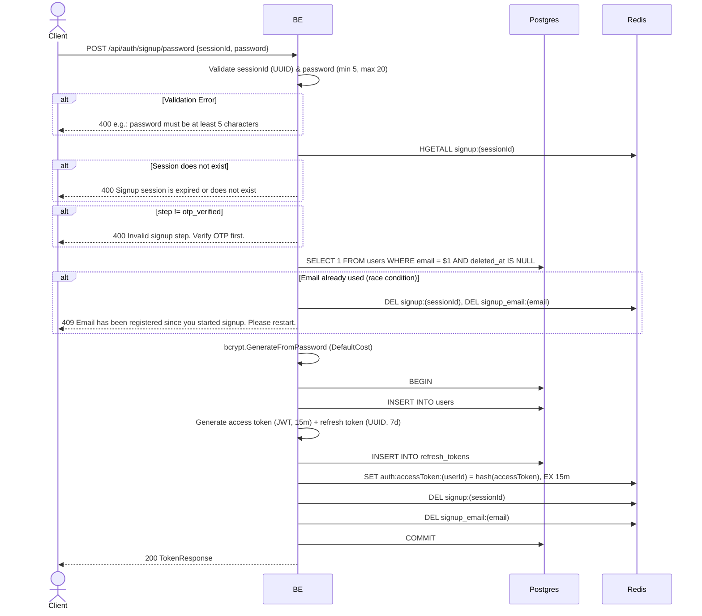

## Overview

This API is used to complete the signup process by setting a password. The backend will create a new user, generate a token pair, store the refresh token in Postgres, and set the access token in Redis. It can only be called after the OTP has been verified.

---

## Auth

This is a public API, so no authorization header is required. But it requires a `sessionId` that is already at the `otp_verified` step.

## Flow



---

## Notes Redis

1. signup session:
   key: `signup:(sessionId)`
   action: HGETALL (read), DEL (cleanup)

2. signup email session:
   key: `signup_email:(email)`
   action: DEL (cleanup)

3. auth access token:
   key: `auth:accessToken:(userId)`
   value: SHA256 hash of access token
   ttl: 15 minutes

---

## Notes Postgres/DB

| Table            | Column       | Action | Notes                                                 |
| ---------------- | ------------ | ------ | ----------------------------------------------------- |
| `users`          | email        | SELECT | Check email has not been claimed by another user (race protection) |
| `users`          | id           | INSERT | New user UUID                                         |
| `users`          | email        | INSERT | Email from the signup session                        |
| `users`          | password     | INSERT | bcrypt hash of the password                          |
| `users`          | settings     | INSERT | Default `{}`                                         |
| `users`          | created_at   | INSERT | UTC now                                              |
| `users`          | updated_at   | INSERT | UTC now                                              |
| `users`          | created_by   | INSERT | userId (self)                                        |
| `users`          | updated_by   | INSERT | userId (self)                                        |
| `refresh_tokens` | id           | INSERT | New UUID                                             |
| `refresh_tokens` | user_id      | INSERT | New userId                                           |
| `refresh_tokens` | token_hash   | INSERT | SHA256 hash of refresh token                         |
| `refresh_tokens` | token_family | INSERT | New UUID (per device family)                         |
| `refresh_tokens` | expires_at   | INSERT | now + 7 days                                         |
| `refresh_tokens` | created_at   | INSERT | UTC now                                              |
| `refresh_tokens` | updated_at   | INSERT | UTC now                                              |
| `refresh_tokens` | created_by   | INSERT | userId                                               |
| `refresh_tokens` | updated_by   | INSERT | userId                                               |

---

## Prerequisites

The user has already hit `start_signup` and `verify_otp` so that the session step = `otp_verified`. The session has not yet expired (Redis TTL 30 minutes).

---

## Request Validation

| Field       | Type   | Required | Rules                                             |
| ----------- | ------ | -------- | ------------------------------------------------- |
| `sessionId` | string | yes      | Required, must be a valid UUID                    |
| `password`  | string | yes      | Required, min 5 characters, max 20 characters     |

---

## Response

### 200 OK

```json
{
  "accessToken": "eyJhbGciOiJIUzI1NiIsInR5cCI6IkpXVCJ9...",
  "accessTokenExpiresIn": 900,
  "refreshToken": "550e8400-e29b-41d4-a716-446655440000",
  "refreshTokenExpiresIn": 604800,
  "tokenType": "Bearer"
}
```

| Field                   | Type   | Description                                        |
| ----------------------- | ------ | -------------------------------------------------- |
| `accessToken`           | string | JWT access token                                   |
| `accessTokenExpiresIn`  | int    | Access token TTL in seconds (900 = 15 minutes)     |
| `refreshToken`          | string | UUID refresh token                                 |
| `refreshTokenExpiresIn` | int    | Refresh token TTL in seconds (604800 = 7 days)     |
| `tokenType`             | string | Always "Bearer"                                    |

### 400 Bad Request

| `error_message`                                | Cause                                     |
| ---------------------------------------------- | ----------------------------------------- |
| `sessionId is required`                        | sessionId empty                           |
| `sessionId is not a valid UUID`                | sessionId format is not a UUID            |
| `password is required`                         | Password empty                            |
| `password must be at least 5 characters`       | Password less than 5 characters           |
| `password must be at most 20 characters`       | Password more than 20 characters          |
| `Signup session is expired or does not exist`  | Session no longer exists in Redis         |
| `Invalid signup step. Verify OTP first.`       | Session step is not yet `otp_verified`    |

### 409 Conflict

| `error_message`                                                       | Cause                                                                                                     |
| --------------------------------------------------------------------- | --------------------------------------------------------------------------------------------------------- |
| `Email has been registered since you started signup. Please restart.` | `CheckEmailUnique` in the usecase returns `true` (email used by another user between start_signup and set_password) |
| `Email already exists`                                                | Race condition: `INSERT INTO users` collides with the email unique index → repository Register catches `23505`     |

---

## Update

This documentation was last updated on 23 May 2026.
