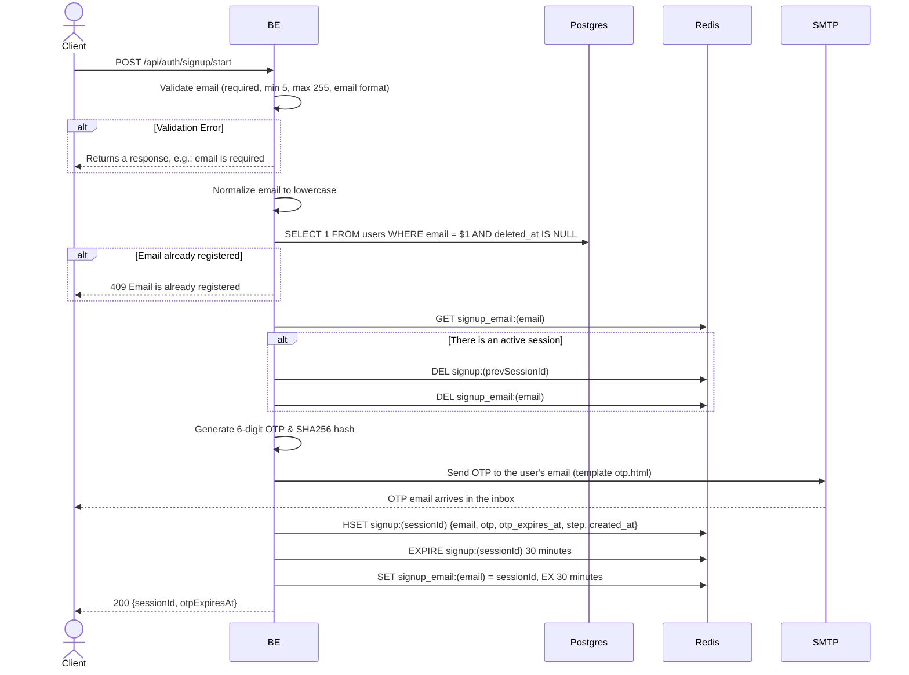

## Overview

This API is used to start the signup process by sending an OTP to the provided email. A session will be created in Redis and the email is sent via SMTP.

---

## Auth

This is a public API, so no authorization header is required.

## Flow



---

## Notes Redis

1. signup session:
   key: `signup:(sessionId)`
   type: HASH
   ttl: 30 minutes
   fields:
   - `email`
   - `otp` (SHA256 hash of the OTP)
   - `otp_expires_at` (unix timestamp, 5 minutes from now)
   - `step` = `start_signup`
   - `created_at` (unix timestamp)

2. signup email session:
   key: `signup_email:(email)`
   value: sessionId
   ttl: 30 minutes

---

## Notes Postgres/DB

| Table   | Column | Action | Notes                                                     |
| ------- | ------ | ------ | --------------------------------------------------------- |
| `users` | email  | SELECT | Check email is unique (filter `deleted_at IS NULL`) before sending the OTP |

---

## Prerequisites

None. The endpoint can be called under any condition. If there is an active signup session for the same email, the old session will be deleted and replaced with a new session.

---

## Request Validation

| Field   | Type   | Required | Rules                                                              |
| ------- | ------ | -------- | ------------------------------------------------------------------- |
| `email` | string | yes      | Required, min 5 characters, max 255 characters, must be a valid email format |

The email is automatically lowercased after validation.

---

## Response

### 200 OK

```json
{
  "sessionId": "550e8400-e29b-41d4-a716-446655440000",
  "otpExpiresAt": 1714829400
}
```

| Field          | Type   | Description                                          |
| -------------- | ------ | ---------------------------------------------------- |
| `sessionId`    | string | UUID session to continue to verify OTP               |
| `otpExpiresAt` | int64  | Unix timestamp OTP expiry (5 minutes from now)       |

### 400 Bad Request

| `error_message`                       | Cause                         |
| ------------------------------------- | ----------------------------- |
| `email is required`                   | Email not filled in           |
| `email must be at least 5 characters` | Email less than 5 characters  |
| `email must be at most 255 characters`| Email more than 255 characters |
| `email must be a valid email address` | Invalid email format          |

### 409 Conflict

| `error_message`                | Cause                                 |
| ------------------------------ | ------------------------------------- |
| `Email is already registered`  | Email already registered in the users table |

---

## Update

This documentation was last updated on 23 May 2026.
