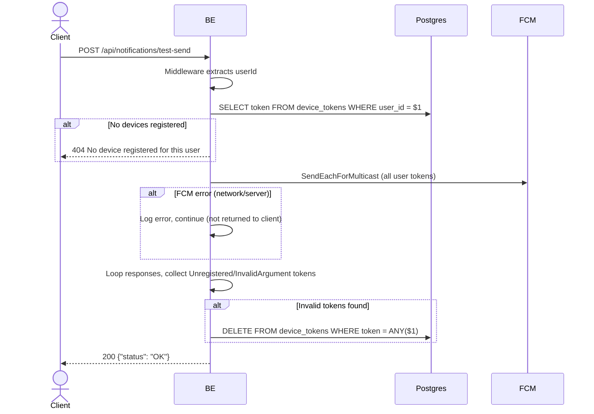

## Overview

Sends a test push notification to all registered devices of the authenticated user. Used to verify the FCM pipeline works end-to-end. Invalid tokens (unregistered/invalid argument) are automatically cleaned up after the send attempt.

---

## Auth

Protected endpoint — requires `Bearer <accessToken>` authorization header.

---

## Flow



---

## Notes Postgres/DB

| Table           | Columns | Action | Description                                      |
| --------------- | ------- | ------ | ------------------------------------------------ |
| `device_tokens` | token   | SELECT | Fetch all tokens for this user                   |
| `device_tokens` | token   | DELETE | Delete invalid tokens after FCM response cleanup |

---

## Notes FCM

- Uses `SendEachForMulticast` — single HTTP call to FCM for all user devices.
- Payload: `notification{Title:"Virdan", Body:"Test notification berhasil."}` + `data{type:"test"}`.
- Android priority: `high`.
- FCM failures (network/server errors) are logged only and not returned as errors to the client.

---

## Response

### 200 OK

```json
{
  "status": "OK"
}
```

### 404 Not Found

| `error_message`                       | Cause                               |
| ------------------------------------- | ----------------------------------- |
| `No device registered for this user`  | User has no registered device token |

### 401 Unauthorized

Standard auth errors.

---

## Updated

Documentation updated on May 30, 2026.
