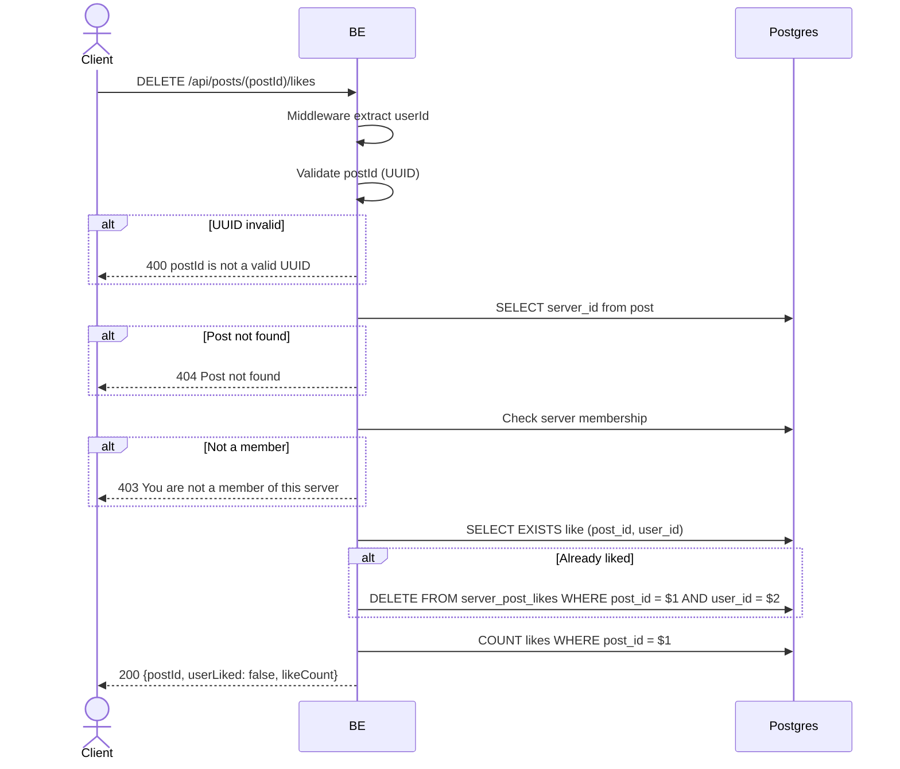

## Overview

This API is used to unlike a post. Idempotent — if the user has not liked it yet, this request still returns 200 (no error). Returns the latest likeCount + `userLiked: false`.

---

## Auth

This is a protected API, so it requires the authorization header `Bearer <accessToken>`.

## Flow



---

## Notes Redis

Does not use Redis.

---

## Notes Postgres/DB

| Table                | Column             | Action | Notes                       |
| -------------------- | ------------------ | ------ | --------------------------- |
| `server_posts`       | server_id          | SELECT | Fetch server_id              |
| `server_members`     | (count)            | SELECT | Check membership             |
| `server_post_likes`  | (exists)           | SELECT | Check whether user already liked |
| `server_post_likes`  | post_id, user_id   | DELETE | Delete like (if present)      |
| `server_post_likes`  | (count)            | SELECT | New likeCount                 |

---

## Prerequisites

The user is a member of the server the post belongs to.

---

## Request Validation

Path parameter:

| Field    | Type   | Required | Rules           |
| -------- | ------ | -------- | --------------- |
| `postId` | string | yes      | Required, UUID  |

No body.

---

## Response

### 200 OK

```json
{
  "postId": "post-uuid",
  "userLiked": false,
  "likeCount": 12
}
```

### 400 Bad Request

| `error_message`               | Cause        |
| ----------------------------- | ------------ |
| `postId is not a valid UUID`  | UUID invalid  |

### 403 Forbidden

| `error_message`                          | Cause        |
| ---------------------------------------- | ------------ |
| `You are not a member of this server`    | Not a member  |

### 404 Not Found

| `error_message`     | Cause               |
| ------------------- | ------------------- |
| `Post not found`    | Post not found       |

### 401 Unauthorized

Standard auth errors.

---

## Update

This documentation was last updated on 23 May 2026.
