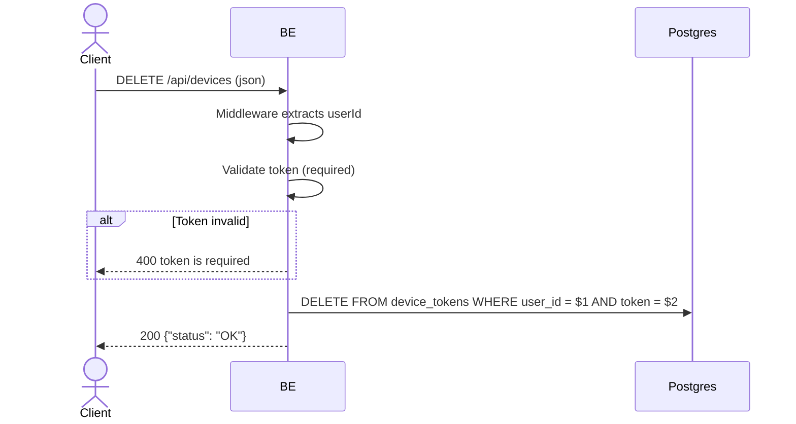

## Overview

Deletes the FCM device token on user logout. The token is removed from `device_tokens` so the device no longer receives push notifications after logout. The token must belong to the authenticated user (scoped to owner).

---

## Auth

Protected endpoint — requires `Bearer <accessToken>` authorization header.

---

## Flow



---

## Notes Postgres/DB

| Table           | Columns        | Action | Description                                       |
| --------------- | -------------- | ------ | ------------------------------------------------- |
| `device_tokens` | user_id, token | DELETE | Delete specific token scoped to the owner user_id |

---

## Request Validation

JSON body:

| Field   | Type   | Required | Rules    |
| ------- | ------ | -------- | -------- |
| `token` | string | yes      | Required |

---

## Response

### 200 OK

```json
{
  "status": "OK"
}
```

200 is also returned if the token was not found (DELETE 0 rows) — intentional so logout always succeeds.

### 400 Bad Request

| `error_message`     | Cause         |
| ------------------- | ------------- |
| `token is required` | Token empty   |

### 401 Unauthorized

Standard auth errors.

---

## Updated

Documentation updated on May 30, 2026.
