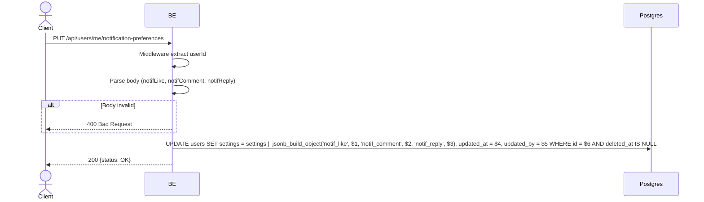

## Overview

This API updates the user's push notification preferences (per-type: like, comment, reply). It follows the IG model: notification rows are always inserted (the feed is a full archive); these preferences ONLY gate whether a push is delivered to the device, not whether the row exists in the feed.

---

## Auth

This is a protected API, so it requires the authorization header `Bearer <accessToken>`.

## Flow



---

## Notes Redis

Does not use Redis.

---

## Notes Postgres/DB

| Table   | Column                         | Action | Notes                                                          |
| ------- | ------------------------------ | ------ | ---------------------------------------------------------------- |
| `users` | settings (notif_like, notif_comment, notif_reply keys) | UPDATE | Merged into the existing JSONB via `settings \|\| jsonb_build_object(...)` |
| `users` | updated_at                     | UPDATE | `time.Now()` (not explicitly UTC-normalized, unlike other endpoints) |
| `users` | updated_by                     | UPDATE | userId (self)                                                  |

---

## Prerequisites

User is logged in (valid access token).

---

## Request Validation

Body (JSON):

There is no field-level validation in the service (no `shared.NewValidator()` checks) — a field omitted from the JSON body simply defaults to `false` rather than triggering a 400.

| Field          | Type | Required | Rules                              |
| -------------- | ---- | -------- | ----------------------------------- |
| `notifLike`    | bool | no       | true/false, defaults to false if omitted |
| `notifComment` | bool | no       | true/false, defaults to false if omitted |
| `notifReply`   | bool | no       | true/false, defaults to false if omitted |

---

## Response

### 200 OK

```json
{
  "status": "OK"
}
```

| Field    | Type   | Description              |
| -------- | ------ | ----------------------- |
| `status` | string | Always `OK` on success  |

### 400 Bad Request

| `error_message`                            | Cause             |
| ------------------------------------------- | ----------------- |
| `The request is invalid or malformed`      | Malformed JSON body (e.g. a field is not a boolean) |

### 401 Unauthorized

Standard auth errors.

---

## Update

This documentation was last updated on 20 July 2026.
