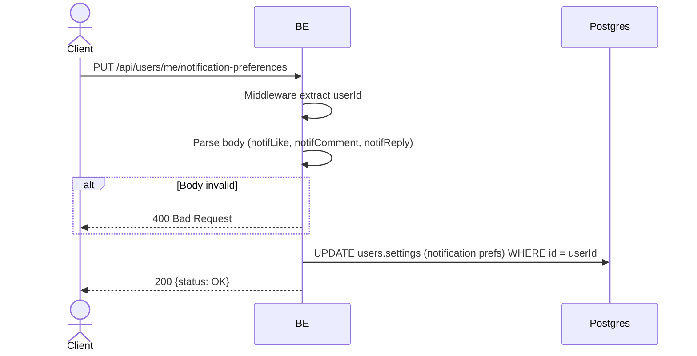

## Overview

This API updates the user's push notification preferences (per-type: like, comment, reply). It follows the IG model: notification rows are always inserted (the feed is a full archive); these preferences ONLY gate whether a push is delivered to the device, not whether the row exists in the feed.

---

## Auth

This is a protected API, so it requires the authorization header `Bearer <accessToken>`.

## Flow



---

## Notes Redis

Does not use Redis.

---

## Notes Postgres/DB

| Table   | Column                         | Action | Notes                                       |
| ------- | ------------------------------ | ------ | ------------------------------------------- |
| `users` | settings (notification prefs)  | UPDATE | Persist the user's per-type push toggles    |

---

## Prerequisites

User is logged in (valid access token).

---

## Request Validation

Body (JSON):

| Field          | Type | Required | Rules      |
| -------------- | ---- | -------- | ---------- |
| `notifLike`    | bool | yes      | true/false |
| `notifComment` | bool | yes      | true/false |
| `notifReply`   | bool | yes      | true/false |

---

## Response

### 200 OK

```json
{
  "status": "OK"
}
```

| Field    | Type   | Description              |
| -------- | ------ | ----------------------- |
| `status` | string | Always `OK` on success  |

### 400 Bad Request

| `error_message`   | Cause            |
| ----------------- | ---------------- |
| Invalid body      | Malformed payload |

### 401 Unauthorized

Standard auth errors.

---

## Update

This documentation was last updated on 3 June 2026.
