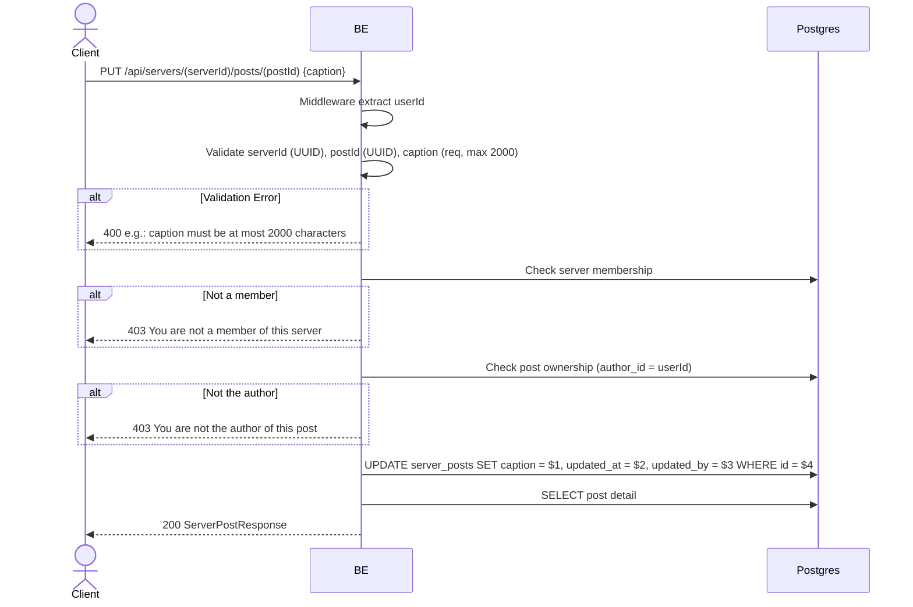

## Overview

This API is used to update a post caption. The image cannot be changed. Only the post author may edit.

---

## Auth

This is a protected API, so it requires the authorization header `Bearer <accessToken>`.

## Flow



---

## Notes Redis

Does not use Redis.

---

## Notes Postgres/DB

| Table            | Column             | Action | Notes               |
| ---------------- | ------------------ | ------ | ------------------- |
| `server_members` | (count)            | SELECT | Check membership    |
| `server_posts`   | author_id          | SELECT | Check ownership     |
| `server_posts`   | caption            | UPDATE | Update caption       |
| `server_posts`   | updated_at         | UPDATE | UTC now              |
| `server_posts`   | updated_by         | UPDATE | userId               |

---

## Prerequisites

The user is a member of the server and the post author.

---

## Request Validation

Path parameter:

| Field      | Type   | Required | Rules           |
| ---------- | ------ | -------- | --------------- |
| `serverId` | string | yes      | Required, UUID  |
| `postId`   | string | yes      | Required, UUID  |

Body JSON:

| Field     | Type   | Required | Rules                        |
| --------- | ------ | -------- | ---------------------------- |
| `caption` | string | yes      | Required, max 2000 characters |

---

## Response

### 200 OK

```json
{
  "id": "post-uuid",
  "serverId": "server-uuid",
  "caption": "Caption baru",
  "imageUrl": "http://.../webp",
  "author": { "userId": "...", "nickname": "...", "username": "...", "avatarUrl": null, "status": "ACTIVE" },
  "likeCount": 5,
  "commentCount": 2,
  "userLiked": false,
  "isOwner": true,
  "createdAt": "2026-05-23T08:00:00Z",
  "updatedAt": "2026-05-23T10:00:00Z"
}
```

### 400 Bad Request

| `error_message`                              | Cause                          |
| -------------------------------------------- | ------------------------------ |
| `serverId is not a valid UUID`               | serverId invalid                |
| `postId is not a valid UUID`                 | postId invalid                  |
| `caption is required`                        | Caption empty                   |
| `caption must be at most 2000 characters`    | Too long                        |

### 403 Forbidden

| `error_message`                          | Cause                   |
| ---------------------------------------- | ----------------------- |
| `You are not a member of this server`    | User is not a member    |
| `You are not the author of this post`    | User is not the post author |

### 401 Unauthorized

Standard auth errors.

---

## Update

This documentation was last updated on 23 May 2026.
