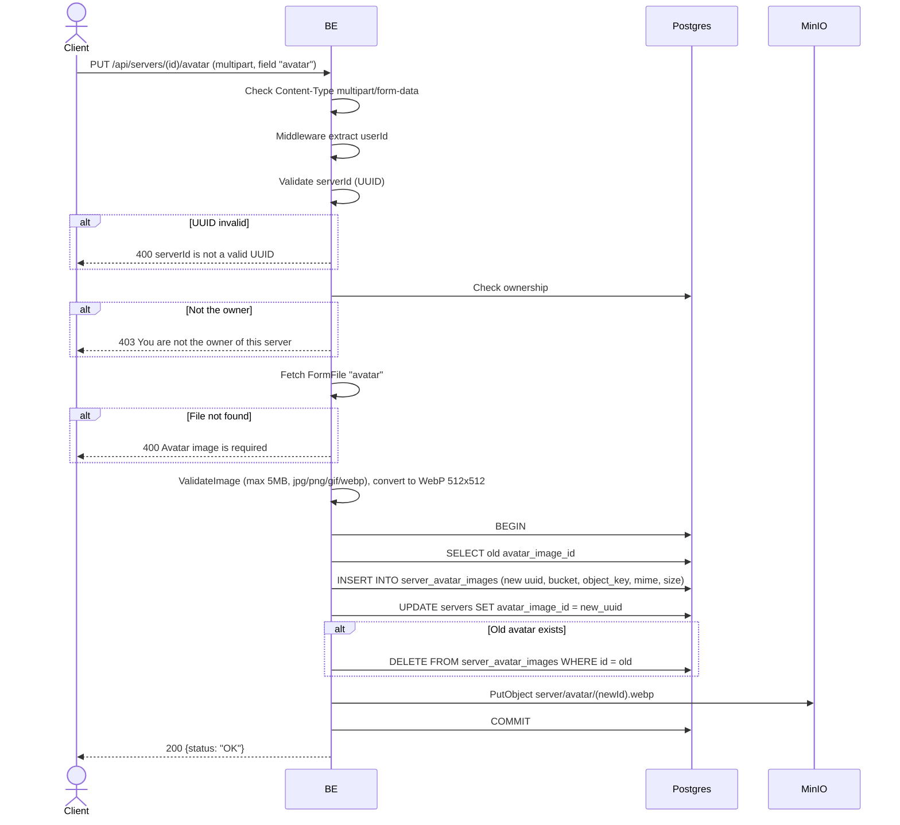

## Overview

This API is used to update a server avatar. Request format is multipart, the file is validated (max 5MB, image format), converted to WebP, uploaded to MinIO, and replaces the old avatar in the DB. The old avatar is deleted from the DB (CASCADE handles child rows). Only the owner may do this.

---

## Auth

This is a protected API, so it requires the authorization header `Bearer <accessToken>`.

## Flow



---

## Notes Redis

Does not use Redis.

---

## Notes MinIO

- Bucket: `MINIO_BUCKET_NAME` (default `virdan`)
- Object key pattern: `server/avatar/{newImageId}.webp`
- Content-Type: `image/webp` (converted from original)
- Action: PutObject

---

## Notes Postgres/DB

| Table                  | Column                                             | Action | Notes                               |
| ---------------------- | -------------------------------------------------- | ------ | ----------------------------------- |
| `servers`              | owner_id                                           | SELECT | Check ownership                     |
| `servers`              | avatar_image_id                                    | SELECT | Fetch old avatar_image_id           |
| `server_avatar_images` | id, bucket, object_key, mime_type, size, ...       | INSERT | New image row                        |
| `servers`              | avatar_image_id, updated_at, updated_by            | UPDATE | Set to new avatar uuid              |
| `server_avatar_images` | id                                                 | DELETE | Delete old image (if present)        |

---

## Prerequisites

The user is the server owner. Has a valid image file.

---

## Request Validation

Request format: `multipart/form-data`.

| Field        | Type   | Required | Rules                                                  |
| ------------ | ------ | -------- | ------------------------------------------------------ |
| `id` (path)  | string | yes      | Required, UUID                                         |
| `avatar`     | file   | yes      | Image (jpg/jpeg/png/gif/webp), max 5MB                 |

---

## Response

### 200 OK

```json
{
  "status": "OK"
}
```

### 400 Bad Request

| `error_message`                                                       | Cause                          |
| --------------------------------------------------------------------- | ------------------------------ |
| `Invalid Content-Type header. Endpoint requires multipart/form-data.` | Content-Type is not multipart  |
| `serverId is not a valid UUID`                                        | UUID invalid                    |
| `Avatar image is required`                                            | File `avatar` not found         |
| `image size exceeded 5MB limit`                                       | File more than 5 MB            |
| `invalid file extension: ...`                                         | Extension not allowed           |
| `invalid image type: ...`                                             | MIME type not allowed           |

### 403 Forbidden

| `error_message`                          | Cause        |
| ---------------------------------------- | ------------ |
| `You are not the owner of this server`   | Not the owner |

### 401 Unauthorized

Standard auth errors.

---

## Update

This documentation was last updated on 23 May 2026.
