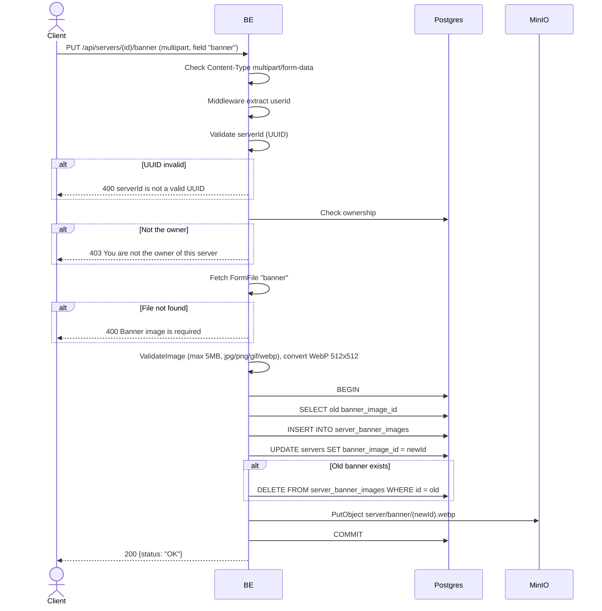

## Overview

This API is used to update a server banner. Multipart format, validate image, convert to WebP, upload to MinIO, replace the old banner. Only the owner may do this.

---

## Auth

This is a protected API, so it requires the authorization header `Bearer <accessToken>`.

## Flow



---

## Notes Redis

Does not use Redis.

---

## Notes MinIO

- Bucket: `MINIO_BUCKET_NAME` (default `virdan`)
- Object key: `server/banner/{newImageId}.webp`
- Content-Type: `image/webp`
- Action: PutObject

---

## Notes Postgres/DB

| Table                  | Column                                             | Action | Notes                       |
| ---------------------- | -------------------------------------------------- | ------ | --------------------------- |
| `servers`              | owner_id                                           | SELECT | Check ownership             |
| `servers`              | banner_image_id                                    | SELECT | Fetch old banner             |
| `server_banner_images` | id, bucket, object_key, mime_type, size, ...       | INSERT | New image row                |
| `servers`              | banner_image_id, updated_at, updated_by            | UPDATE | Set new banner               |
| `server_banner_images` | id                                                 | DELETE | Delete old image             |

---

## Prerequisites

The user is the server owner. Has a valid image file.

---

## Request Validation

Format: `multipart/form-data`.

| Field        | Type   | Required | Rules                                   |
| ------------ | ------ | -------- | --------------------------------------- |
| `id` (path)  | string | yes      | Required, UUID                           |
| `banner`     | file   | yes      | Image (jpg/jpeg/png/gif/webp), max 5MB  |

---

## Response

### 200 OK

```json
{
  "status": "OK"
}
```

### 400 Bad Request

| `error_message`                                                       | Cause                          |
| --------------------------------------------------------------------- | ------------------------------ |
| `Invalid Content-Type header. Endpoint requires multipart/form-data.` | Content-Type is not multipart  |
| `serverId is not a valid UUID`                                        | UUID invalid                    |
| `Banner image is required`                                            | Banner file not found           |
| `image size exceeded 5MB limit`                                       | File too large                  |
| `invalid file extension: ...`                                         | Extension not allowed           |
| `invalid image type: ...`                                             | MIME type not allowed           |

### 403 Forbidden

| `error_message`                          | Cause        |
| ---------------------------------------- | ------------ |
| `You are not the owner of this server`   | Not the owner |

### 401 Unauthorized

Standard auth errors.

---

## Update

This documentation was last updated on 23 May 2026.
