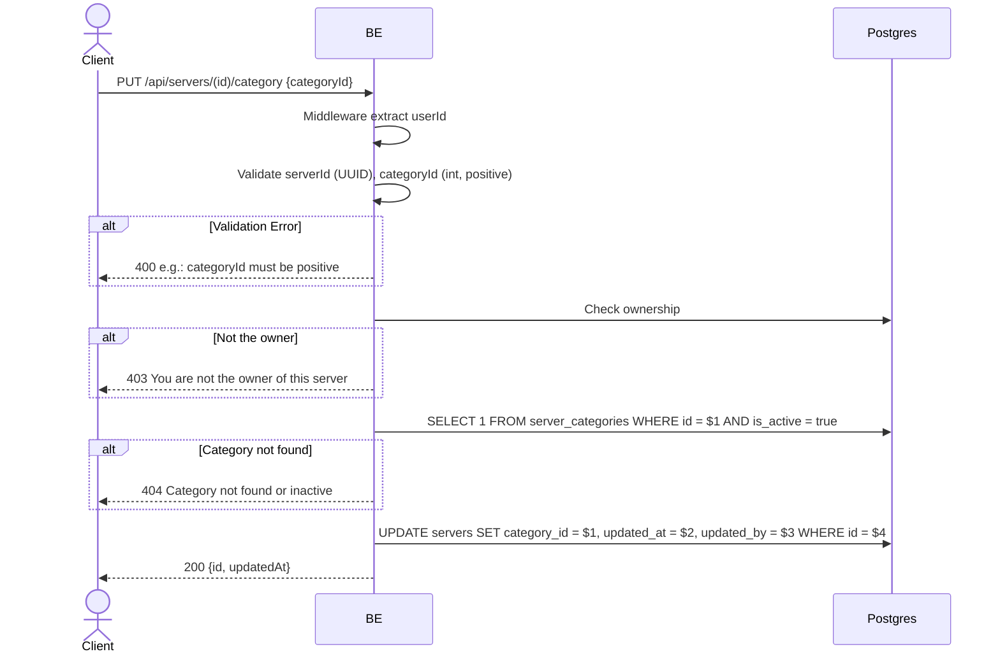

## Overview

This API is used to change a server category. Only the owner may do this. The backend checks that the category is active before updating.

---

## Auth

This is a protected API, so it requires the authorization header `Bearer <accessToken>`.

## Flow



---

## Notes Redis

Does not use Redis.

---

## Notes Postgres/DB

| Table               | Column        | Action | Notes                         |
| ------------------- | ------------ | ------ | ----------------------------- |
| `servers`           | owner_id     | SELECT | Check ownership               |
| `server_categories` | id, is_active | SELECT | Check category exists & active |
| `servers`           | category_id  | UPDATE | Set new category              |
| `servers`           | updated_at   | UPDATE | UTC now                        |
| `servers`           | updated_by   | UPDATE | userId                         |

---

## Prerequisites

The user is the server owner.

---

## Request Validation

| Field        | Type   | Required | Rules                   |
| ------------ | ------ | -------- | ----------------------- |
| `id` (path)  | string | yes      | Required, UUID          |
| `categoryId` | int    | yes      | Required, positive > 0  |

---

## Response

### 200 OK

```json
{
  "id": "uuid",
  "updatedAt": "2026-05-23T10:00:00Z"
}
```

### 400 Bad Request

| `error_message`                  | Cause                          |
| -------------------------------- | ------------------------------ |
| `serverId is not a valid UUID`   | UUID invalid                    |
| `categoryId is required`         | CategoryId empty                |
| `categoryId must be positive`    | CategoryId <= 0                 |

### 403 Forbidden

| `error_message`                          | Cause             |
| ---------------------------------------- | ----------------- |
| `You are not the owner of this server`   | Not the owner     |

### 404 Not Found

| `error_message`                       | Cause                             |
| ------------------------------------- | --------------------------------- |
| `Category not found or inactive`      | Category not found / is_active=false |

### 401 Unauthorized

Standard auth errors.

---

## Update

This documentation was last updated on 23 May 2026.
