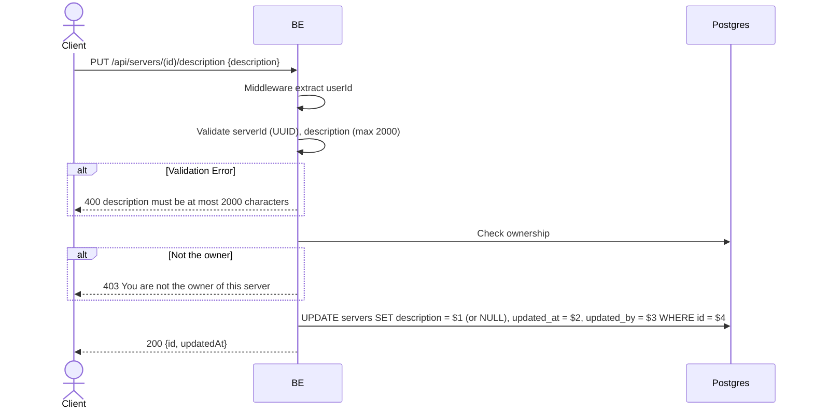

## Overview

This API is used to change a server description. Only the owner may do this. The description may be empty (it becomes NULL in the DB).

---

## Auth

This is a protected API, so it requires the authorization header `Bearer <accessToken>`.

## Flow



---

## Notes Redis

Does not use Redis.

---

## Notes Postgres/DB

| Table     | Column      | Action | Notes                                             |
| --------- | ----------- | ------ | ------------------------------------------------- |
| `servers` | owner_id    | SELECT | Check ownership                                   |
| `servers` | description | UPDATE | Set new description (NULL if empty string)        |
| `servers` | updated_at  | UPDATE | UTC now                                            |
| `servers` | updated_by  | UPDATE | userId                                             |

---

## Prerequisites

The user is the server owner.

---

## Request Validation

| Field         | Type   | Required | Rules                        |
| ------------- | ------ | -------- | ---------------------------- |
| `id` (path)   | string | yes      | Required, UUID               |
| `description` | string | no       | Max 2000 characters          |

---

## Response

### 200 OK

```json
{
  "id": "uuid",
  "updatedAt": "2026-05-23T10:00:00Z"
}
```

### 400 Bad Request

| `error_message`                              | Cause             |
| -------------------------------------------- | ----------------- |
| `serverId is not a valid UUID`               | UUID invalid       |
| `description must be at most 2000 characters` | Description > 2000 |

### 403 Forbidden

| `error_message`                          | Cause        |
| ---------------------------------------- | ------------ |
| `You are not the owner of this server`   | Not the owner |

### 401 Unauthorized

Standard auth errors.

---

## Update

This documentation was last updated on 23 May 2026.
