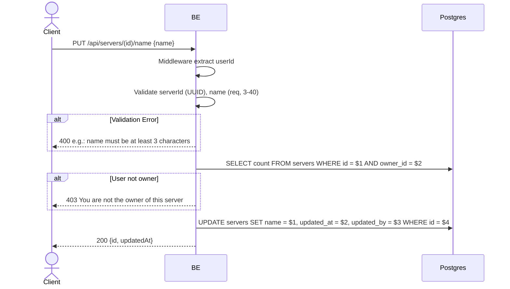

## Overview

This API is used to change the server name. Only the server owner is allowed.

---

## Auth

This is a protected API, so it requires the authorization header `Bearer <accessToken>`.

## Flow



---

## Notes Redis

Does not use Redis (other than the auth-check middleware).

---

## Notes Postgres/DB

| Table     | Column             | Action | Notes                            |
| --------- | ------------------ | ------ | -------------------------------- |
| `servers` | owner_id           | SELECT | Check ownership                  |
| `servers` | name               | UPDATE | Set new name                     |
| `servers` | updated_at         | UPDATE | UTC now                          |
| `servers` | updated_by         | UPDATE | userId (self)                    |

---

## Prerequisites

The user is the server owner and has a valid access token.

---

## Request Validation

Path parameter:

| Field | Type   | Required | Rules           |
| ----- | ------ | -------- | --------------- |
| `id`  | string | yes      | Required, UUID  |

Body JSON:

| Field  | Type   | Required | Rules                             |
| ------ | ------ | -------- | --------------------------------- |
| `name` | string | yes      | Required, min 3, max 40 characters  |

---

## Response

### 200 OK

```json
{
  "id": "uuid",
  "updatedAt": "2026-05-23T10:00:00Z"
}
```

### 400 Bad Request

| `error_message`                       | Cause                          |
| ------------------------------------- | ------------------------------ |
| `serverId is not a valid UUID`        | serverId is not a UUID         |
| `name is required`                    | Name is empty                  |
| `name must be at least 3 characters`  | Name is less than 3            |
| `name must be at most 40 characters`  | Name is more than 40           |

### 403 Forbidden

| `error_message`                          | Cause                   |
| ---------------------------------------- | ----------------------- |
| `You are not the owner of this server`   | User is not the owner   |

### 401 Unauthorized

Standard auth errors.

---

## Update

This documentation was last updated on 23 May 2026.
